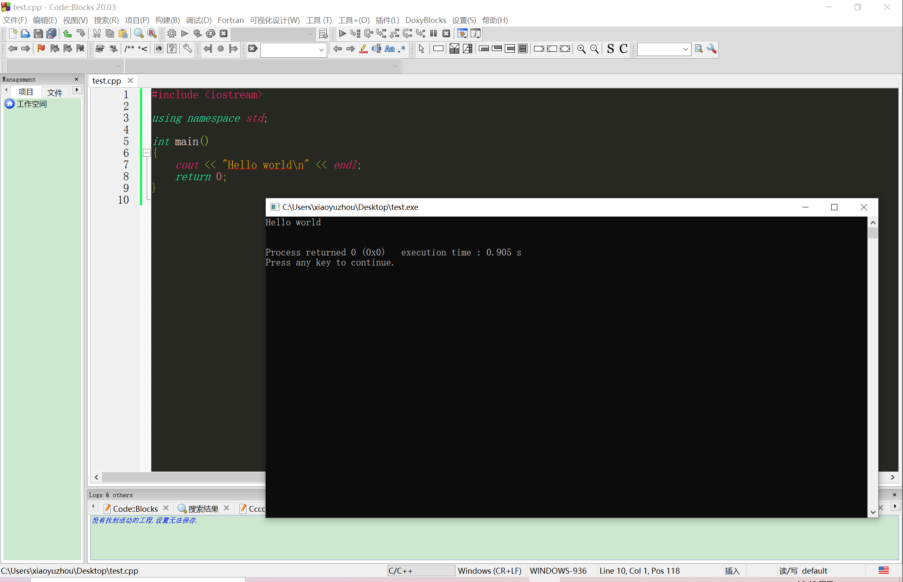

# 开发环境搭建

## 安装Code::Blocks

1. 进入官网下载地址（<https://sourceforge.net/projects/codeblocks/files/Binaries/20.03/Windows/>）
    这里是**20.03Windows**版本的，可通过修改链接中的版本号下载对应版本

2. 选择**codeblocks-20.03mingw-setup.exe**
    这个版本附带MinGW（Windows下的C/C++编译器）

3. 安装（傻瓜安装，一路next，记得改安装路径即可）
    **安装完后*不要运行***

4. 配置MinGW环境变量
    将以下路径加入环境变量：
    安装路径\CodeBlocks\MinGW\bin
    安装路径\CodeBlocks\MinGW\lib

5. 修改Code::Blocks主题和语言
    1. 下载配色文件（<http://note.youdao.com/s/CutVPZ9R>）

    2. 下载汉化包（<https://pan.baidu.com/s/1PKTVUdi4N9A80ZDXK41TtQ> 提取码：bdll ）

    3. 剩下步骤可以看我的博客<https://www.cnblogs.com/zhujiangyu/p/13471831.html>
    只是版本号和下载地址不同，操作一样

效果：

