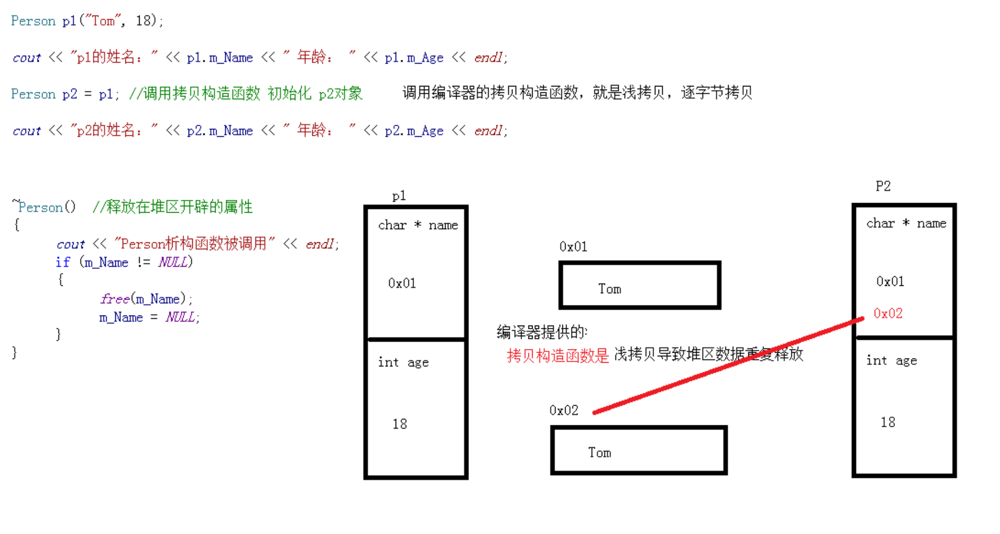
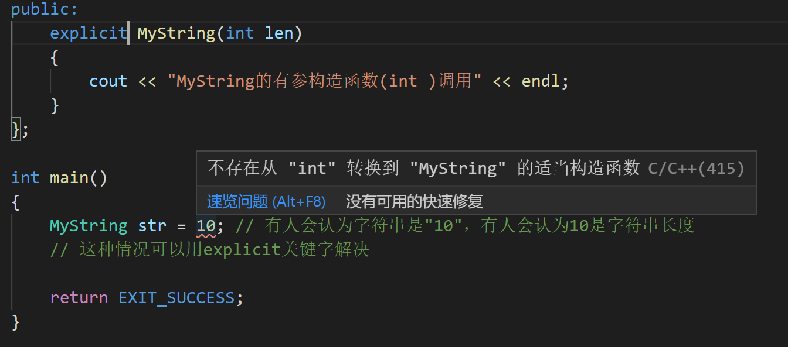

# 类和对象

[TOC]

## 引出

### 设计圆类

```cpp
#include <cstdio>
#include <cstdlib>
#include <iostream>

using namespace std;

const double PI = 3.1415926;

// 圆类
// 语法：class 类名（首字母大写）
class Circle
{
// 在类中写的所有属性和行为都叫成员
public: // 公共权限
    // 半径 属性
    int m_R; // 半径

    // 求周长 行为
    double calculateZC()
    {
        return 2 * PI * m_R;
    }
};

int main()
{
    // 方法1
    Circle c1; // 通过类创建Circle对象c1（实例化）
    // 通过.访问类中的属性和行为
    c1.m_R = 10;
    cout << c1.calculateZC() << endl;

    // 方法2
    Circle *c1 = new Circle(); // new相当于malloc
    c1->m_R = 10;
    cout << c1->calculateZC() << endl;
    delete c1; // new分配的内存要用delete释放

    return EXIT_SUCCESS;
}
```

```shell
62.8319
```

>new运算符后面再讲

## 权限

### public、private、protected

权限 | 类内 | 类外
:-: | :-: | :-:
public | 可访问 | 可访问
private | 可访问 | 不可访问
protected | 可访问 | 不可访问

```cpp
#include <cstdio>
#include <cstdlib>
#include <iostream>

using namespace std;

const double PI = 3.1415926;

class Circle
{
public:
    int getR()
    {
        return m_R;
    }

    void setR(int r)
    {
        m_R = r;
    }

    double calculateZC()
    {
        return 2 * PI * m_R;
    }
private:
    int m_R; // 可写可读
};

int main()
{
    // 必须通过类提供的接口去访问
    Circle c1;
    //c1.m_R = 10; // 报错
    c1.setR(10);
    //cout << c1.m_R << endl; // 报错
    cout << c1.getR() << endl;
    cout << c1.calculateZC() << endl;

    return EXIT_SUCCESS;
}
```

```shell
10
62.8319
```

### class和struct

>class默认权限是private
>
>struct默认权限是public

---

以下内容无比重要

## 对象的构造和析构

### 初始化和清理

>日常中购买的产品都会有一个初始化设置，也有清理功能（恢复出厂设置）

>C++中对象的初始化和清理是两个非常重要的安全问题，解决方案为**构造函数和析构函数**，这两个函数由编译器**自动调用**，如果你不写，编译器会自动添加空函数

### 构造函数和析构函数

```cpp
#include <cstdio>
#include <cstdlib>
#include <iostream>

using namespace std;

class Person
{
public: // 构造和析构函数要写到public权限下
    // 构造函数的写法
    // 1. 不需要返回值
    // 2. 构造函数的名称与类名相同
    // 3. 允许有参数，可以发生函数重载
    Person()
    {
        cout << "Person的构造函数调用" << endl;
    }

    // 析构函数
    // 1. 不需要返回值
    // 2. 析构函数与构造函数名称相同，但前面要加~
    // 3. 不允许有参数，不可以发生重载
    ~Person()
    {
        cout << "Person的析构函数调用" << endl;
    }
};

int main()
{
    Person p1; // 构造函数由编译器自动调用一次
    cout << "程序结束，销毁对象" << endl;

    return EXIT_SUCCESS;
}
```

```shell
Person的构造函数调用
程序结束，销毁对象
Person的析构函数调用 # 析构函数在对象销毁前自动调用
```

### 构造函数的分类

* 分类方式1
    * 参数
    * 无参构造
    * 有参构造
* 分类方式2
	* 类型
	* 拷贝构造
	* 普通构造

```cpp
#include <cstdio>
#include <cstdlib>
#include <iostream>

using namespace std;

class Person
{
public:
    Person()
    {
        cout << "Person的默认构造函数调用" << endl;
    }

    Person(int a)
    {
        cout << "Person的有参构造函数调用" << endl;
    }

    // 拷贝构造 // 值传递的本质就是调用拷贝构造函数
    Person(const Person &p)
    {
        cout << "Person的拷贝构造函数调用" << endl;
    }

    ~Person()
    {
        cout << "Person的析构函数调用" << endl;
    }
};

int main()
{
    Person *p = new Person();
    delete p;
    Person *p2 = new Person(1);
    Person *p3 = new Person(*p2);
    delete p2;
    delete p3;

    return EXIT_SUCCESS;
}
```

```shell
Person的默认构造函数调用
Person的析构函数调用
Person的有参构造函数调用
Person的拷贝构造函数调用
Person的析构函数调用
Person的析构函数调用
```

### 构造函数的调用

```cpp
#include <cstdio>
#include <cstdlib>
#include <iostream>
#include <string>

using namespace std;

class Person
{
public:
    Person()
    {
        cout << "Person的默认构造函数调用" << endl;
    }

    Person(int a)
    {
        cout << "Person的有参构造函数调用" << endl;
    }

    // 拷贝构造 // 值传递的本质就是调用拷贝构造函数
    Person(const Person &p)
    {
        cout << "Person的拷贝构造函数调用" << endl;
    }

    ~Person()
    {
        cout << m_name << "的析构函数调用" << endl;
    }

    unsigned short m_age;
    string m_name;
};

int main()
{
    // 括号法
    Person p1; // 默认构造函数的调用方式
    p1.m_name = "p1";
    Person p2(10); // 有参构造函数调用
    p2.m_age = 13;
    p2.m_name = "p2";
    Person p3(p2); // 调用拷贝构造函数
    p3.m_name = "p3";
    cout << "p2:" << p2.m_age << endl << "p3:" << p3.m_age << endl;

    // 注意
    // 不要用Person p();调用默认构造函数，这会被当做函数声明

    // 显示法
    Person p4 = Person(1);
    p4.m_name = "p4";
    Person p5 = Person(p4);
    p5.m_name = "p5";

    Person(10); // 单独写称为匿名对象，执行完后立即释放

    // 注意：不要用拷贝构造函数初始化匿名对象
    // Person(p5); // 相当于Person p5;

    // 隐式转化法
    Person p6 = 10;
    p6.m_name = "p6";
    Person p7 = p6;
    p7.m_name = "p7";

    return EXIT_SUCCESS;
}
```

```shell
Person的默认构造函数调用
Person的有参构造函数调用
Person的拷贝构造函数调用
p2:13
p3:8
Person的有参构造函数调用
Person的拷贝构造函数调用
Person的有参构造函数调用
的析构函数调用
Person的有参构造函数调用
Person的拷贝构造函数调用
p7的析构函数调用
p6的析构函数调用
p5的析构函数调用
p4的析构函数调用
p3的析构函数调用
p2的析构函数调用
p1的析构函数调用
```

>从上面的执行结果可以发现：对象的释放顺序和初始化顺序相反，这是因为**栈区是先入后出**

### 拷贝构造函数的调用时机

1. 用已经创建好的对象初始化新对象
2. 值传递的方式给函数参数传值
	```cpp
    void test(Person p)
    {
    	// 函数被调用时p的拷贝构造函数也会被调用
    }
    ```
3. 以值的方式返回局部对象

### 构造函数的调用规则

* C++编译器会默认给一个类至少添加3个函数
    * 默认构造  （空实现）
    * 析构函数  （空实现）
    * 拷贝构造  （值拷贝）
* 如果我们提供有参构造
    * 编译器就不提供默认构造
    * 编译器提供拷贝构造
* 如果我们提供拷贝构造
	* 编译器就不提供其他普通构造

## 浅拷贝与深拷贝

### 问题

```cpp
#include <cstdio>
#include <cstdlib>
#include <iostream>
#include <cstring>
#include <string>

using namespace std;

class Person
{
public:
    Person(char *name,int age)
    {
        m_name = (char*)malloc(strlen(name) + 1);
        strcpy(m_name, name);

        m_age = age;
    }

    int m_age;
    char *m_name;

    ~Person()
    {// 释放
        cout << "Person的析构函数调用" << endl;
        if (m_name != NULL)
        {
            free(m_name);
        }
    }
};

int main()
{
    Person p1("Mike",13);
    cout << "p1的姓名：" << p1.m_name << endl;
    cout << "年龄：" << p1.m_age << endl;

    Person p2 = p1; // 调用编译器的拷贝构造函数，就是浅拷贝，逐字节拷贝
    cout << "p2的姓名：" << p1.m_name << endl;
    cout << "年龄：" << p1.m_age << endl;

    return EXIT_SUCCESS;
}
```

```shell
p1的姓名：Mike
年龄：13
p2的姓名：Mike
年龄：13
Person的析构函数调用
Person的析构函数调用
```

>浅拷贝导致两个对象中的m_name指向同一块内存，多次释放
>


### 解决

```cpp
// 自己提供拷贝构造函数，实现深拷贝
Person(Person &p)
{
    m_age = p.m_age;
    //m_name = p.m_name; // 编译器提供的就是这行代码

    m_name = (char*)malloc(strlen(p.m_name) + 1);
    strcpy(m_name,p.m_name);
}
```

## 初始化列表

### 需用户传入实参

```cpp
#include <cstdio>
#include <cstdlib>
#include <iostream>
#include <cstring>
#include <string>

using namespace std;

class Person
{
public:
    //Person(int a,int b,int c)
    //{
    //    m_A = a;
    //    m_B = b;
    //    m_C = c;
    //}

    // 初始化列表
    Person(int a,int b,int c) : m_A(a), m_B(b), m_C(c)
    {
        ;
    }

    int m_A;
    int m_B;
    int m_C;
};

int main()
{
    Person p1(1,2,3);
    cout << "m_A = " << p1.m_A << endl;
    cout << "m_B = " << p1.m_B << endl;
    cout << "m_C = " << p1.m_C << endl;

    return EXIT_SUCCESS;
}
```

```shell
m_A = 1
m_B = 2
m_C = 3
```

### 不需要传入实参，默认初始化

```cpp
#include <cstdio>
#include <cstdlib>
#include <iostream>
#include <cstring>
#include <string>

using namespace std;

class Person
{
public:
    //Person(int a,int b,int c)
    //{
    //    m_A = a;
    //    m_B = b;
    //    m_C = c;
    //}

    // 初始化列表
    Person() : m_A(10), m_B(100), m_C(1000)
    {
        ;
    }

    int m_A;
    int m_B;
    int m_C;
};

int main()
{
    Person p1;
    cout << "m_A = " << p1.m_A << endl;
    cout << "m_B = " << p1.m_B << endl;
    cout << "m_C = " << p1.m_C << endl;

    return EXIT_SUCCESS;
}
```

```shell
m_A = 10
m_B = 100
m_C = 1000
```

## 其他

### 类对象作为类成员

```cpp
#include <cstdio>
#include <cstdlib>
#include <iostream>
#include <string>

using namespace std;

// 手机类
class Phone
{
public:
    Phone()
    {
        cout << "Phone的默认构造函数调用" << endl;
    }

    Phone(string name)
    {
        cout << "Phone的有参构造函数调用" << endl;
        m_PhoneName = name;
    }

    ~Phone()
    {
        cout << "Phone的析构函数调用" << endl;
    }

    string m_PhoneName;
};

class Person
{
public:
    Person()
    {
        cout << "Person的默认构造函数调用" << endl;
    }

    ~Person()
    {
        cout << "Person的析构函数调用" << endl;
    }
    string m_Name;
    Phone phone;
};

int main()
{
    Person p1; // 当其他类作为本类的成员时，构造的顺序是先调用其他类的构造函数，再调用本类的构造函数

    return EXIT_SUCCESS;
}
```

```shell
Phone的默认构造函数调用
Person的默认构造函数调用
Person的析构函数调用
Phone的析构函数调用
```

```cpp
#include <cstdio>
#include <cstdlib>
#include <iostream>
#include <string>

using namespace std;

// 手机类
class Phone
{
public:
    Phone()
    {
        cout << "Phone的默认构造函数调用" << endl;
    }

    Phone(string name)
    {
        cout << "Phone的有参构造函数调用" << endl;
        m_PhoneName = name;
    }

    ~Phone()
    {
        cout << "Phone的析构函数调用" << endl;
    }

    string m_PhoneName;
};

class Person
{
public:
    Person()
    {
        cout << "Person的默认构造函数调用" << endl;
    }

    Person(string name,string Pname) : m_Name(name), phone(Pname)
    {
        cout << "Person的有参构造函数调用" << endl;
    }

    ~Person()
    {
        cout << "Person的析构函数调用" << endl;
    }
    string m_Name;
    Phone phone;
};

int main()
{
    //Person p1; // 当其他类作为本类的成员时，构造的顺序是先调用其他类的构造函数，再调用本类的构造函数
    Person p2("Tom","苹果");

    return EXIT_SUCCESS;
}
```

```shell
Phone的有参构造函数调用
Person的有参构造函数调用
Person的析构函数调用
Phone的析构函数调用
```

### explicit关键字

* explicit用于修饰构造函数，防止隐式转化
* 是针对单参数的构造函数，或除了第一个参数其余都是默认参数的构造函数

```cpp
#include <cstdio>
#include <cstdlib>
#include <iostream>
#include <string>

using namespace std;

class MyString
{
public:
    MyString(int len)
    {
        cout << "MyString的有参构造函数(int )调用" << endl;
    }
};

int main()
{
    MyString str = 10; // 有人会认为字符串是"10"，有人会认为10是字符串长度
    // 这种情况可以用explicit关键字解决

    return EXIT_SUCCESS;
}
```



### new运算符

>C++中解决动态内存分配的方案是把创建一个对象的所有操作都结合到一个叫new的操作符中

```cpp
#include <cstdio>
#include <cstdlib>
#include <iostream>
#include <string>

using namespace std;

class Person
{
public:
    Person()
    {
        cout << "Person的默认构造函数调用" << endl;
    }

    Person(int a)
    {
        cout << "Person的有参构造函数调用" << endl;
    }

    Person(const Person &p)
    {
        cout << "Person的拷贝构造函数调用" << endl;
    }

    ~Person()
    {
        cout << m_name << "的析构函数调用" << endl;
    }

    unsigned short m_age;
    string m_name;
};

int main()
{
    // new也是在堆区开辟数据
    Person *p1 = new Person;
    Person *p2 = new Person(10);
    Person *p3 = new Person(*p2);

    delete p1; // new分配的内存要用delete释放
    delete p2;
    delete p3;

    return EXIT_SUCCESS;
}
```

#### 注意

>不要用void* 接受new出来的对象

#### 利用new开辟数组

```cpp
int *intArray = new int[10];
char *charArray = new char[100];
// 如果利用new开辟自定义类型数据的数组时，必须有默认构造函数
Person *PArray = new Person[10];
// 如果在栈上开辟数组，可以没有默认构造函数
Person pArray[2] = { Person(1),Person(2) };
```

>注意：```new```分配的数组应该用```delete[]```来释放

#### new和malloc的区别

* malloc --  free
* new   -- delete
* malloc  free 本质 库函数
* new   delete  本质 运算符
* malloc 返回值  void * 
* new 返回 创建的对象的指针类型
