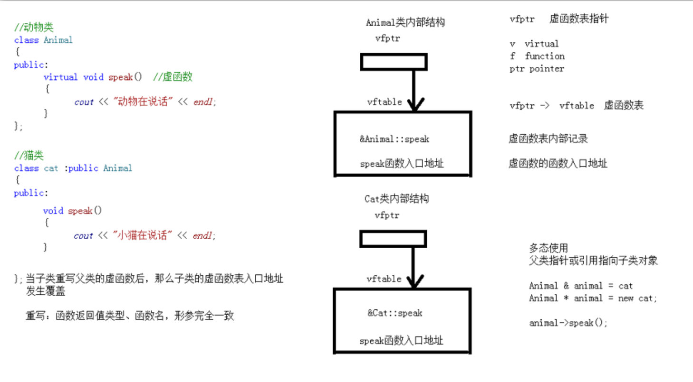
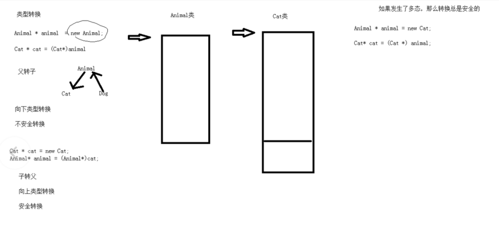

# 多态

[TOC]

## 基本概念

>多态性提供接口与具体实现之间的另一层隔离，将“什么”和“怎么做”分开

分类

* 静态多态（函数地址早绑定）
	* 运算符重载
	* 函数重载
* 动态多态（函数地址晚绑定）
	* 派生类
	* 虚函数

## 地址早绑定和地址晚绑定

### 早绑定

```cpp
#include <iostream>

using namespace std;

// 动物类
class Animal
{
public:
    void speak() {
        cout << "动物在说话" << endl;
    }
};

class Dog : public Animal
{
    void speak() {
        cout << "狗在说话" << endl;
    }
};

class Cat : public Animal
{
    void speak() {
        cout << "猫在说话" << endl;
    }
};

void doSpeak(Animal &a) { // 父类的引用指向子类对象
    a.speak(); // 属于地址早绑定
}

void test01() {
    Dog d;
    doSpeak(d);
    
    Cat c;
    doSpeak(c);
}

int main() {
    test01();

    return EXIT_SUCCESS;
}
```

```
动物在说话
动物在说话
```

>此时我们需要地址晚绑定

### 晚绑定（虚函数）

```cpp
#include <iostream>

using namespace std;

// 动物类
class Animal
{
public:
    virtual void speak() { // 虚函数
        cout << "动物在说话" << endl;
    }
};

class Dog : public Animal
{
    void speak() {
        cout << "狗在说话" << endl;
    }
};

class Cat : public Animal
{
    void speak() {
        cout << "猫在说话" << endl;
    }
};

void doSpeak(Animal &a) {
    a.speak();
}

void test01() {
    Dog d;
    doSpeak(d);

    Cat c;
    doSpeak(c);
}

int main() {
    test01();

    return EXIT_SUCCESS;
}
```

```shell
狗在说话
猫在说话
```

### 原理



#### 应用

```cpp
#include <iostream>

using namespace std;

// 动物类
class Animal
{
public:
    virtual void speak() { // 虚函数
        cout << "动物在说话" << endl;
    }
};

class Dog : public Animal
{
    void speak() {
        cout << "狗在说话" << endl;
    }
};

class Cat : public Animal
{
    void speak() {
        cout << "猫在说话" << endl;
    }
};

void doSpeak(Animal &a) {
    a.speak();
}

void test() {
    Animal *animal = new Cat;
    // animal->speak();

    // *(int *)animal 解引用到了虚函数表中
    // *(int *)*(int *)animal 解引用到了函数入口地址
    ((void(*)())(*(int *)*(int *)animal))();
}

int main() {
    test();

    return EXIT_SUCCESS;
}
```

```shell
猫在说话
```

## 应用：计算器类

```cpp
#include <iostream>

using namespace std;

// 开闭原则：对拓展进行开放 对修改进行关闭

class AbstractCalculator
{
public:
    // 虚函数
    virtual int getResult() {
        return 0;
    }
    
    int m_A;
    int m_B;
};

class AddCalculator : public AbstractCalculator
{
public:
    virtual int getResult() {
        return m_A + m_B;
    }
};

class MulCalculator : public AbstractCalculator
{
public:
    virtual int getResult() {
        return m_A * m_B;
    }
};

int main() {
    AbstractCalculator *cal = new AddCalculator;
    cal->m_A = 10;
    cal->m_B = 20;
    cout << cal->getResult() << endl;
    
    delete cal;
    
    cal = new MulCalculator;
    cal->m_A = 10;
    cal->m_B = 20;
    cout << cal->getResult() << endl;
    
    delete cal;

    return EXIT_SUCCESS;
}
```

```shell
30
200
```

>使用多态可以方便拓展和修改

## 纯虚函数和抽象类

```cpp
class AbstractCalculator
{
public:
    // 虚函数
//    virtual int getResult() {
//        return 0;
//    }

    // 纯虚函数
    // 当类中有了纯虚函数时，这个类属于抽象类
    // 抽象类无法创建对象
    // 当子类继承了抽象类，那么这个子类必须重写父类中的虚函数，否则子类也是抽象类
    virtual int getResult() = 0;

    int m_A;
    int m_B;
};
```

## 虚析构和纯虚析构

```cpp
#include <iostream>
#include <cstring>

using namespace std;

class Animal
{
public:
    virtual void speak() = 0;

    Animal() {
        cout << "Animal构造函数调用" << endl;
    }

    // 利用虚析构可以解决不调用子虚构的问题
//    virtual ~Animal() {
//        cout << "Animal的析构函数调用" << endl;
//    }

    virtual ~Animal() = 0; // 纯虚析构需要有声明，也需要有实现
};

Animal::~Animal() {
    cout << "Animal的纯虚析构函数调用" << endl;
}

class Cat : public Animal
{
public:
    Cat(char *name) {
        this->m_Name = new char[strlen(name)+1];
        strcpy(this->m_Name,name);
    }

    char *m_Name;

    void speak() {
        cout << "小猫" << this->m_Name << "在说话" << endl;
    }

    ~Cat() {
        if (this->m_Name != nullptr) {
            delete this->m_Name;
            this->m_Name = nullptr;
            cout << "Cat的析构函数调用" << endl;
        }
    }
};

int main() {
    Animal *cat = new Cat("Tom");
    cat->speak();
    delete cat;

    return EXIT_SUCCESS;
}
```

```shell
Animal构造函数调用
小猫Tom在说话
Cat的析构函数调用
Animal的纯虚析构函数调用
```

## 类型转换

