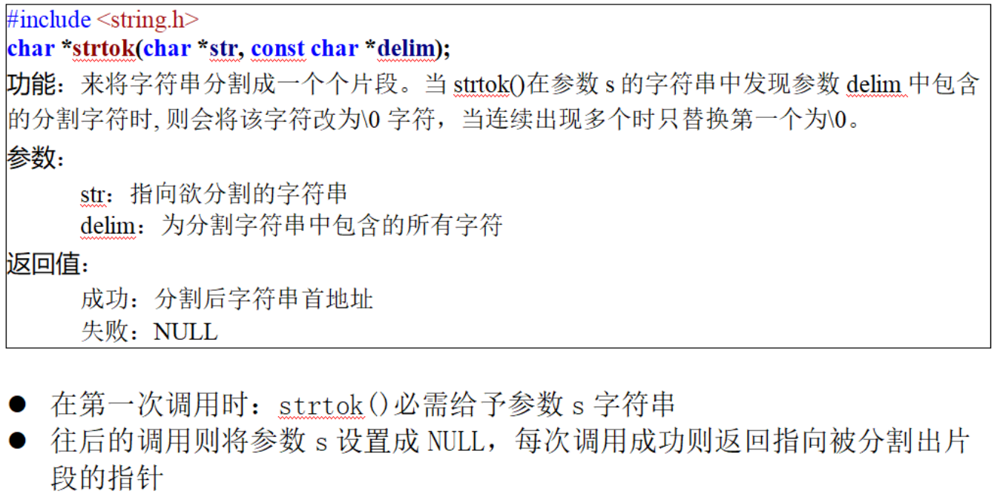

# 字符操作函数
## 头文件
```c
#include <string.h>
```

## strcpy字符拷贝
```c
#include <string.h>

char * strcpy(char * dest,const char * source);
功能：将source所指的字符串拷贝到dest所指的内存空间中，
      '\0'也会被拷贝
参数：
    dest：目的字符串首地址
    source：源字符首地址
返回：
    成功：dest字符串首地址
    失败：NULL
```
==注意！如果dest所指的内存不够大，则可能造成缓冲溢出==
例：
```c
#define _CRT_SECURE_NO_WARNINGS
#include <stdio.h>
#include <string.h>

int main(int argc, char *argv[])
{
	char s[20] = "";
	strcpy(s,"Hello\0world!");
	puts(s);

	return 0;
}
```
```shell
Hello
```

## strncpy只拷贝前n个字符
```c
#include <string.h>

char * strncpy(char * dest,const char * source,size_t n);
功能：将source所指字符串的前n个字符拷贝到dest所指的内存空间中，
      '\0'也会被拷贝
参数：
    dest：目的字符串首地址
    source：源字符首地址
    n：拷贝字符个数
返回：
    成功：dest字符串首地址
    失败：NULL
```
==是否结束拷贝是由'\0'决定的==
例：
```c
#define _CRT_SECURE_NO_WARNINGS
#include <stdio.h>
#include <string.h>

int main(int argc, char *argv[])
{
	char s1[20] = "";
	char s2[20] = "";
	strncpy(s1,"Hello\0world!",7);
	puts(s1);

	strncpy(s2,"Hello world!",7);
	puts(s2);

	return 0;
}
```
```shell
Hello
Hello w
```

## strcat字符串拼接
```c
#include <string.h>

char * strcat(char * dest,const char * source);
功能：将source所指的字符串连接到dest字符串后面，'\0'也会追加
参数：
    dest：目的字符串首地址
    source：源字符首地址
返回：
    成功：dest字符串首地址
    失败：NULL
```
例：
```c
#define _CRT_SECURE_NO_WARNINGS
#include <stdio.h>
#include <string.h>

int main(int argc, char *argv[])
{
	char s1[20] = "Hello";
	char s2[20] = " world";
	strcat(s1,s2);
	puts(s1);

	return 0;
}
```
```shell
Hello world
```

## strncat
```c
#define _CRT_SECURE_NO_WARNINGS
#include <stdio.h>
#include <string.h>

int main(int argc, char *argv[])
{
	char s1[20] = "Hello";
	char s2[20] = " world";
	strncat(s1,s2,3);
	puts(s1);

	return 0;
}
```
```shell
Hello wo
```

## strcmp比较字符串大小
```c
#include <string.h>

char * strcmp(const char *str1,const char *str2);
功能：比较str1和str2的ASCII字符大小
参数：
    str1：字符串1首地址
    str2：字符串2首地址
返回：
    相等：0
    大于：>0
    小于：<0
    不同操作系统会有差异
```
例：
```c
#define _CRT_SECURE_NO_WARNINGS
#include <stdio.h>
#include <string.h>

int main(int argc, char *argv[])
{
	char s1[20] = "Hello";
	char s2[20] = "world";
	printf("%d\n%d\n",strcmp(s1,"Hello"),strcmp(s1,s2));

	return 0;
}
```
```shell
0
-1
```

## strncmp
```c
#define _CRT_SECURE_NO_WARNINGS
#include <stdio.h>
#include <string.h>

int main(int argc, char *argv[])
{
	char s1[20] = "Hello";
	char s2[20] = "world";
	printf("%d\n%d\n",strcmp(s1,"Hello"),strncmp(s1,s2,1));

	return 0;
}
```
```shell
0
-47
```

## 组包解包
```c
#define _CRT_SECURE_NO_WARNINGS
#include <stdio.h>
#include <string.h>

int main(int argc, char *argv[])
{
	char s1[20];
	// 将字符串组包（格式化）后保存到s1中
	sprintf(s1,"Hello%d,%s",123,"abcd");
	int a;
	char b[5];
	// 将字符串解包后分别保存到变量中
	sscanf(s1,"Hello%d,%s",&a,&b);
	printf("%d\n%s\n",a,b);

	return 0;
}
```
```shell
123
abcd
```

## strchr字符查找
```c
#include <string.h>

char * strchr(const char *str,int val);
功能：在str中寻找val第一次出现的位置
参数：
    str：被查找的字符串首地址
    val：匹配字符
返回：
    成功：val第一次出现的地址
    失败：NULL
```
例：
```c
#define _CRT_SECURE_NO_WARNINGS
#include <stdio.h>
#include <string.h>

int main(int argc, char *argv[])
{
	printf("请输入一个字符串：");
	char s[32];
	scanf("%s",s);
	getchar();
	printf("请输入要查找的字符：");
	char val;
	val = getchar();
	getchar();
	char *ret = NULL;
	ret = strchr(s,val);
	if (ret == NULL)
	{
		printf("未找到%c\n",val);
	}
	else
	{
		printf("地址：%p\n位置：%d\n",ret,(ret-s));
	}

	return 0;
}
```
```shell
PS D:\> ./main   
请输入一个字符串：abcdf
请输入要查找的字符：f
地址：0060FE7C
位置：4

PS D:\> ./main
请输入一个字符串：ac
请输入要查找的字符：d
未找到d
```
例2：
```c
#define _CRT_SECURE_NO_WARNINGS
#include <stdio.h>
#include <string.h>

int main(int argc, char *argv[])
{
	char s[32] = "aebecede";
	char *buf = &s[0];
	char *ret = NULL;
	while (ret = strchr(buf,'e'))
	{
		printf("地址：%#d\n",ret);
		*ret = '@';
		buf = ret + 1;
	}
	printf("%s\n",s);

	return 0;
}
```
```shell
地址：6356601
地址：6356603
地址：6356605
地址：6356607
a@b@c@d@
```

## strstr字符串查找
```c
#define _CRT_SECURE_NO_WARNINGS
#include <stdio.h>
#include <string.h>

int main(int argc, char *argv[])
{
	printf("请输入一个字符串：");
	char s[32];
	scanf("%s",s);
	getchar();
	printf("请输入要查找的字符串：");
	char val[32];
	scanf("%s",val);
	getchar();
	char *ret = NULL;
	ret = strstr(s,val);
	if (ret == NULL)
	{
		printf("未找到%c\n",val);
	}
	else
	{
		printf("地址：%p\n位置：%d\n",ret,(ret-s));
	}

	return 0;
}
```
```shell
请输入一个字符串：abHelloc
请输入要查找的字符串：Hello
地址：0060FE7E
位置：2
```

## strtok字符切割

