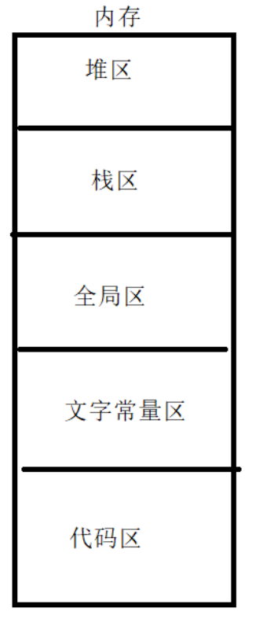
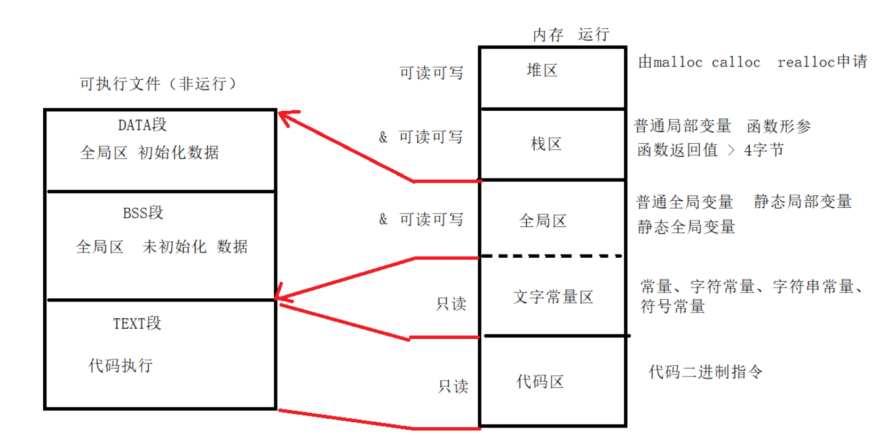
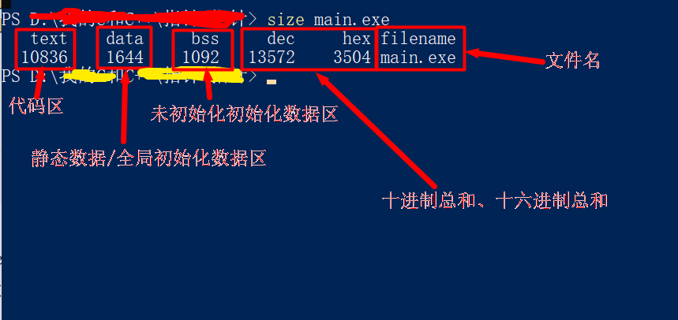
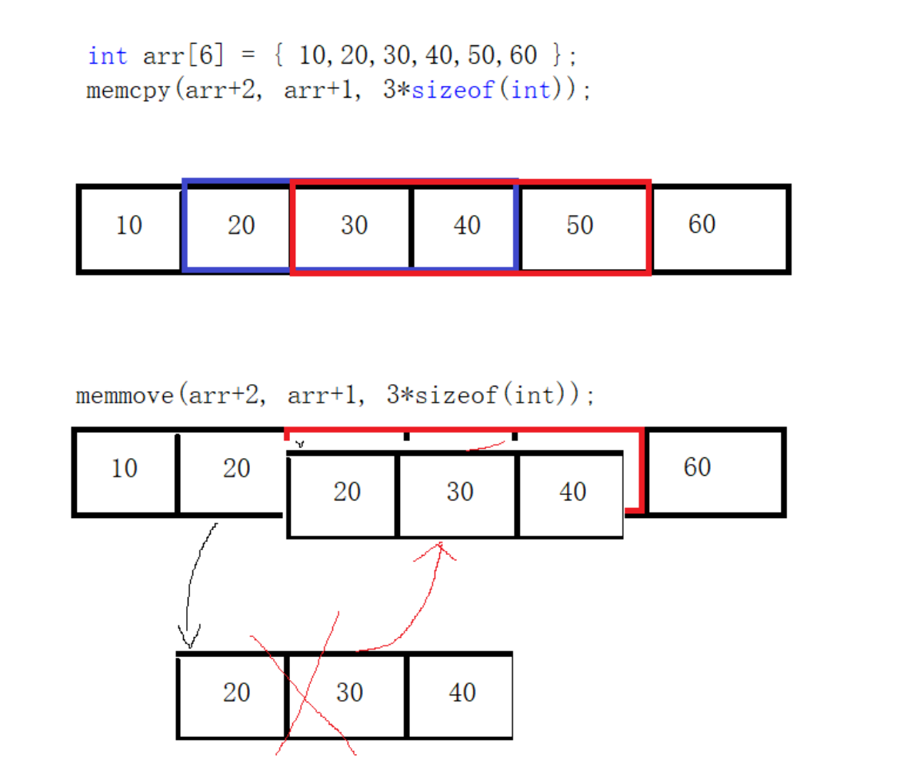

# 内存管理
## 内存分区



## 普通局部变量

### 定义

```c
// 局部变量
// 在{}里面定义的不加任何修饰的变量 就是局部变量
// 作用范围：离它最近的{}之间
// 生命周期：离它最近的{}结束，局部变量就释放
// 储存空间：栈区
// 注意事项：
    // 局部变量 不初始化 内容随机
    // 不同范围局部变量同名 就近原则

// 例
#include <stdio.h>

void test()
{
    int num;
    printf("%d\n",num); // 局部变量，作用域：test函数
}
int main()
{
    test();

    return 0;
}

// 运行结果：
4200363
```

## 普通全局变量

```c
// 全局变量
// 定义：在函数外定义的变量 就是普通全局变量
// 作用范围：当前源文件和其他源文件（加extern修饰）
// 生命周期：整个进程
// 存储空间：全局区
// 注意事项：
    // 普通全局变量不初始化 内容为0
    // 普通全局变量和普通局部变量同名 就近原则

// 例
#include <stdio.h>

int num; // 普通全局变量

int main()
{
    printf("%d",num);

    return 0;
}

// 运行结果
0
```

## 静态局部变量（static修饰）

```c
// 静态局部变量
// 在{}里面定义的 用static修饰 的变量 就是静态局部变量
// 作用范围：离它最近的{}之间
// 生命周期：整个进程
// 储存空间：全局区
// 注意事项：
    // 静态局部变量不初始化 内容为0
    // 静态局部变量多次初始化 只有第一次有效

// 例
#include <stdio.h>

int test()
{
    static int num = 10; // 静态局部变量
    ++num;
    printf("%d\n",num);
}

int main()
{
    test();
    test();
    test();

    return 0;
}

// 运行结果
11
12
13
```

## 静态全局变量

```c
// 静态全局变量
// 定义：在函数外定义的 被static修饰 的变量 就是普通全局变量
// 作用范围：只在当前源文件有效
// 生命周期：整个进程
// 存储空间：全局区
// 注意事项：
    // 普通全局变量不初始化 内容为0
```

## 静态函数与普通函数的区别

```c
// 普通函数
int test1(){;}

// 静态函数
static int test2(){;}

// 普通函数：当前源文件和其他源文件（加extern修饰）都可以使用
// 静态函数：只可以在当前源文件使用
```

## 内存分区详解





* 代码区：存放程序的代码，即CPU执行的机器指令，并且是只读的。
* 常量区：存放常量
* 静态区（全局区）：静态变量和全局变量的存储区域是一起的，静态区的内存直到程序全部结束之后才会被释放
* 堆区：由程序员调用malloc()函数来主动申请的，需使用free()函数来释放内存
* 栈区：存放函数内的局部变量，形参和函数返回值。栈区之中的数据的作用范围过了之后，系统就会回收自动管理栈区的内存(分配内存 , 回收内存),不需要开发人员来手动管理

## 内存操作函数

>以mem开头

### memset内存填充函数

```c
#include <string.h>

void *memset(void *s,int c,size_t n);
功能：将s内存区域的前n个字节以参数c填入

参数：
    s：需要操作内存的首地址
    c：需填充的字符，为unsigned char
    n：需要设置的大小

返回值：s的首地址
注意：memset遇到'\0'不会停止
```

***memset常用来清空内存***

例：
```c
#include <stdio.h>
#include <string.h>

int main()
{
    char s[32] = "Hello world";

    memset(s,'a',32); // 一般不用，没什么意义
    printf("s = %s\n",s);

    // 清空s
    memset(s,0,32);

    return 0;
}
```
```shell
s = aaaaaaaaaaaaaaaaaaaaaaaaaaaaaaaa" # 由于没有'\0'会出现乱码
```

## memcpy内存拷贝

```c
#include <string.h>

void *memcpy(void *dest, const void *src, size_t n);
功能：拷贝src所指的内存的前n个字节到dest所指的内存中

参数：
    dest：目的内存地址
    src：源内存地址 // dest和src所指的内存不可重叠
    n：需要拷贝的字节数
返回值：dest首地址
```
例：
```c
#include <stdio.h>
#include <string.h>

int main()
{
    char s[32] = "";
    char s2[32] = "Hello\0world";

    memset(s,0,32);
    memcpy(s,s2,sizeof(s2));

    for (size_t i = 0; i < sizeof(s); ++i)
    {
        printf("%c",s[i]);
    }
    printf("\n");

    int a[5] = {0};
    int a2[5] = {1,2,3,4,5};

    memcpy(a,a2,sizeof(a2));

    for (size_t i = 0; i < 5; ++i)
    {
        printf("%d ",a[i]);
    }
    printf("\n");

    return 0;
}
```
```shell
Hello world
1 2 3 4 5
```
***注意：memcpy拷贝的内存不要重叠，重叠用memmove***

## memmove



## memcmp内存比较

```c
#include <string.h>

int memcmp(const void *s1, const void *s2, size_t n);
功能：比较s1和s2内存空间的前n个字节

返回：
    相等：0
    大于：>0
    小于：<0
```

例：

```c
#include <stdio.h>
#include <string.h>

int main()
{
	char s[] = "Hello world";
	char s2[] = "hello world";

	printf("%d\n",memcmp(s,s2,sizeof(s2)));

	return 0;
}
```
```shell
-32
```

## 动态内存管理

### 堆空间动态申请malloc

***malloc申请的空间需要用free手动释放
malloc申请的地址需强制类型转换才能使用***

```c
#include <stdlib.h>

void *malloc(size_t n);
功能：在内存的动态储存区（堆区）申请一块
连续的长度为n字节的空间，内容不确定，一般用memset初始化

返回：
    成功：分配空间的首地址
    失败：NULL

void free(void *ptr);
功能：释放ptr所指的内存空间，多次释放会出错

参数：空间的首地址
返回：无
注意：ptr必须是由malloc分配的空间
```

例：

```c
#include <stdio.h>
#include <string.h>

int main()
{
	int *arr = NULL;
	arr = (int*)malloc(sizeof(int));
	if (arr == NULL)
	{
		printf("申请失败\n");
		exit(1);
	}
	*arr = 100;
	printf("*arr = %d\narr = %#x\n",*arr,arr);
	free(arr);
	arr = NULL;

	return 0;
}
```
```shell
*arr = 100
arr = 0x4f5372a0
```

### realloc重新分配内存

```c
#include <stdlib.h>

void *realloc(void *ptr, size_t size);
功能：修改 ptr 指向的内存空间大小为 size 字节
参数：
    ptr：1. 指向由先前调用 malloc、calloc 或 realloc 函数返回的内存空间
         2. 如果该参数为 NULL，相当于调用 malloc(size) 函数
    size：指定新的内存块空间大小，以字节为单位
返回：
    1. 如果函数调用成功，返回值是指向新的内存空间的指针，由于返回类型是 void 指针（void *），所以它可以被转换成任何类型的数据。
    2. 如果函数调用失败，返回值是 NULL。
    3. 如果 realloc 函数调用失败，
    那么原始内存空间的数据并不会修改，也不会被释放或移动。
注意：
    如果新分配的内存空间比原来的大，
    则旧内存块的数据不会发生改变；
    如果新的内存空间大小小于旧的内存空间，
    可能会导致数据丢失
```

```c
#include <stdio.h>
#include <stdlib.h>

int main()
{
	int num;
	int *ptr = NULL; // 注意：这里必须初始化为NULL
	int count = 0;
	printf("请输入整数（0表示结束）：\n");
	do {
		printf(">");
		scanf("%d",&num);
		++count;

		ptr = (int *)realloc(ptr,count*sizeof(int));
		if (ptr == NULL) {
			printf("内存不足\n");
			exit(1);
		}

		ptr[count - 1] = num;
	} while (num != 0);
	printf("你输入的是：\n");
	for (size_t i = 0; i < count; ++i) {
		printf("%d\n",ptr[i]);
	}

	if (ptr != NULL) {
		free(ptr);
	}

	return 0;
}
```

```shell
请输入整数（0表示结束）：
>1
>3
>45
>33
>55
>0
你输入的是：
1
3
45
33
55
0
```

### calloc申请并初始化内存空间

>用法同malloc，calloc申请后会自动初始化为0

## 内存操作注意事项

**1. 不要返回局部变量地址，可以返回静态局部变量地址**
**2. 不要操作已被释放的堆区**
**3. 不要多次释放同一个堆区**