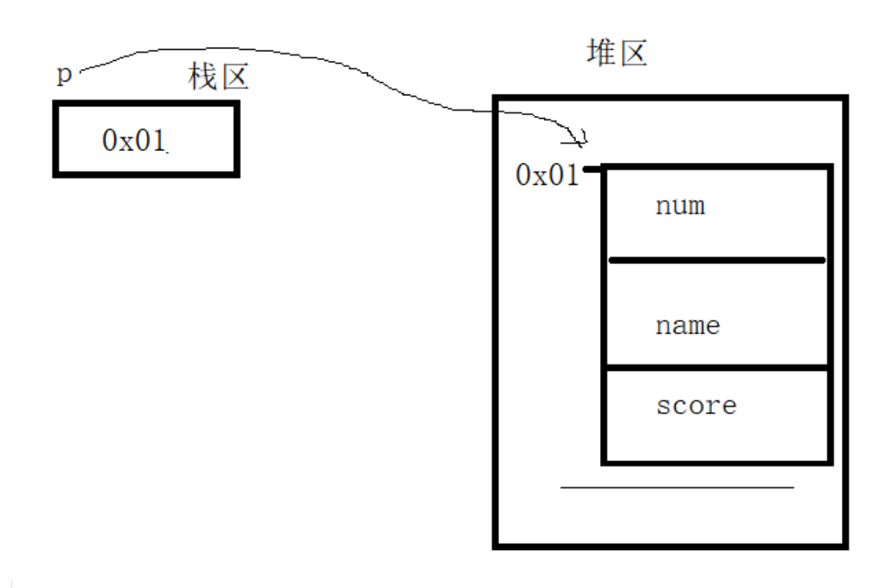

# 复合类型

## 结构体

>结构体中的成员空间是独立的，没有空间，只有大小

### 定义

```c
// stu结构体，相当于一个模具
struct stu
{
    int num; // 不要赋值
    char name[16];
    int age;
}; // 一定要有分号
```

### 结构体变量的定义

```c
// 方法一：定义结构体同时定义变量
struct stu
{
    int num;
    char name[16];
    int age;
}lucy; // lucy为结构体变量

// 方法二：定义结构体后定义变量
struct stu
{
    int num;
    char name[16];
    int age;
};

struct stu lucy; // 结构体变量
```

### 初始化与赋值

```c
#include <stdio.h>

struct stu
{
    int num;
    char name[16];
    int age;
}lucy = {1,"Lucy",13}; // 初始化

int main()
{
    // 数据必须和成员顺序一样
    struct stu bob = {2,"BOb",14}; // 初始化
    bob.age = 15; // 赋值
    printf("lucy.name = %s\nbob.age = %d\n",lucy.name,bob.age);

    return 0;
}
```

```shell
lucy.name = Lucy
bob.age = 15
```

>两个相同结构体变量可以直接用来赋值

```c
struct stu
{
    int num;
    char name[16];
    int age;
};

struct stu bob,lucy;
lucy = {1,"Lucy",14};
bob = lucy; // 直接用同类型结构体赋值
```

### 结构体数组

```c
#include <stdio.h>
#include <string.h>

struct stu
{
    int num;
    char name[16];
    int age;
};

int main()
{
    struct stu arr[5];
    memset(arr,0,sizeof(arr));

    printf("请输入5个学生信息：\n");
    for (size_t i = 0; i < 5; ++i)
    {
        scanf("%d %s %d",&arr[i].num,&arr[i].name,&arr[i].age);
    }
    int sum;
    for (size_t i = 0; i < 5; ++i)
    {
        sum += arr[i].age;
    }

    printf("平均年龄：%.2f\n",(double)sum / 5.0);

    return 0;
}
```

```shell
请输入5个学生信息：
1 Bob 13
2 Lucy 14
3 Jack 12
4 小李 11
5 小王 14
平均年龄：17.40
```


### 结构体嵌套结构体


### 结构体指针


```c
#include <stdio.h>
#include <string.h>

struct stu
{
    int num;
    char name[16];
    int age;
};

int main()
{
    struct stu lucy;
    struct stu *p = NULL;

    memset(&lucy,0,sizeof(lucy));
    p = &lucy;

    printf("请输入数据：");
    scanf("%d %s %d",&p -> num, &p -> name, &p -> age); 

    printf("lucy.age = %d\n\
p -> age = %d\n\
lucy.name = %s\n\
p -> name = %s\n\
lucy.num = %d\n\
p -> num = %d\n",
lucy.age,
p -> age,
lucy.name,
p -> name,
lucy.num,
p -> num);

    return 0;
}
```

```shell
请输入数据：1 Lucy 14
lucy.age = 14
p -> age = 14
lucy.name = Lucy
p -> name = Lucy
lucy.num = 1
p -> num = 1
```

### 结构体空间在堆区



```c
#include <stdio.h>
#include <string.h>
#include <stdlib.h>

struct stu
{
    int num;
    char name[16];
    int age;
};

int main()
{
    struct stu *p = NULL;
    p = (struct stu *)malloc(sizeof(struct stu));
    memset(p,0,sizeof(struct stu));

    scanf("%d %s %d",&p -> num, &p -> name, &p -> age);

    printf("num = %d\nname = %s\nage = %d\n",p -> num,p -> name,p -> age);

    if (p != NULL)
    {
        free(p);
        p = NULL;
    }

    return 0;
}
```

```shell
1 Jack 14
num = 1
name = Jack
age = 14
```

### 堆区的结构体数组


```c
#include <stdio.h>
#include <string.h>
#include <stdlib.h>

struct stu
{
    int num;
    char name[16];
    int age;
};

int main()
{
    int n;
    printf("请输入学生个数：");
    scanf("%d",&n);

    struct stu *arr = NULL;
    arr = (struct stu *)malloc(n * (sizeof(struct stu)));

    for (size_t i = 0; i < n; ++i)
    {
        printf("请输入第%d个学生数据：",i + 1);
        scanf("%d %s %d",&arr[i].num, &arr[i].name, &arr[i].age);
    }
    
    for (size_t i2 = 0; i2 < n; ++i2)
    {
        printf("num = %d, name = %s, age = %d\n",(arr + i2) -> num, (arr + i2) -> name, (arr + i2) -> age);
    }

    if (arr != NULL)
    {
        free(arr);
        arr = NULL;
    }

    return 0;
}
```

```shell
请输入学生个数：3
请输入第1个学生数据：1 Lucy 13
请输入第2个学生数据：2 Jack 14
请输入第3个学生数据：3 Bob 15
num = 1, name = Lucy, age = 13
num = 2, name = Jack, age = 14
num = 3, name = Bob, age = 15
```

### 结构体成员为指针

```c
// 例1：C语言实现“类”
#include <stdio.h>
#include <string.h>
#include <stdlib.h>

struct people
{
    int money;
    void (*makemoney)(struct people *people1);
};

static void __makemoney(struct people *people1)
{
    people1 -> money += 1000;
}

int main()
{
    struct people people1 = {100,__makemoney};
    printf("money：%d\n",people1.money);
    people1.makemoney(&people1);
    printf("money：%d\n",people1.money);

    return 0;
}
```

```shell
money：100
money：1100
```

**结构体在堆区，成员也指向堆区**


### 内存对齐

>[原文链接：](https://mp.weixin.qq.com/s/H1rgISh5usodzHs8qnxgAw)<https://mp.weixin.qq.com/s/H1rgISh5usodzHs8qnxgAw>

>文章来源于编程珠玑 ，作者守望先生

## 共用体


```c
#include <stdio.h>
#include <string.h>
#include <stdlib.h>

union data
{
    int a;
    int b;
    int c;
};


int main()
{
    printf("大小：%d\n",sizeof(union data));
    union data data1;
    data1.a = 1;
    data1.b = 3;
    data1.c = 10;

    printf("a = %d\nsum = %d\n",data1.a,data1.a + data1.b + data1.c);

    return 0;
}
```

```shell
大小：4
a = 10
sum = 30
```

**共用体虽然共用一段空间，但成员能使用空间的大小由成员自身类型决定**

```c
#include <stdio.h>
#include <string.h>
#include <stdlib.h>

union data
{
    int a;
    short b;
    char c;
};

int main()
{
    printf("大小：%d\n",sizeof(union data));
    union data data1;
    data1.a = 0x01020304;

    printf("a = %#x\nb = %#x\nc = %#x\n",data1.a,data1.b,data1.c);

    return 0;
}
```

```shell
大小：4
a = 0x1020304
b = 0x304
c = 0x4
```


## 枚举

>将要赋的值一一列出来

定义：
```c
enum 名称 {枚举列表};
```

例：

```c
#include <stdio.h>

enum BOOL {True = 1,False = 0};

int main()
{
    enum BOOL flag = True;
    if (flag)
    {
        printf("True\n");
    }

    return 0;
}
```

```shell
True
```

## typedef

>为**已有的类型**取一个别名

```c
#include <stdio.h>

typedef int Int32; // 给int取别名
typedef enum BOOL {True = 1,False = 0}Bool; // 给枚举取别名

typedef struct
{
    Int32 num; // 相当于int num;
}stu;

stu student;

int main()
{
    Bool flag = True;
    if (flag)
    {
        printf("True\n");
    }

    return 0;
}
```