# 文件操作

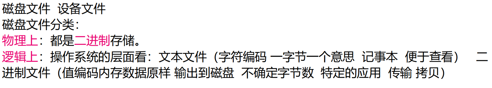

## 文件指针

>操作系统通过 函数（API） 操作文件，而函数通过文件指针识别不同文件

>函数 --> 文件指针 --> 文件

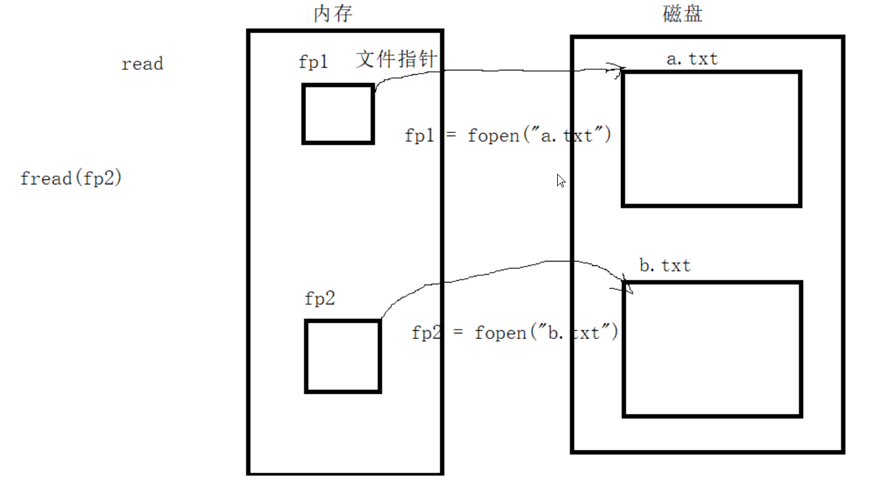

## 打开和关闭文件

### fopen打开文件

```c
#include <stdio.h>

FILE *fopen(const char *filename,const char *mode);
功能：打开文件
参数：
    filename：文件名
    mode：打开文件的模式
返回值：
    成功：文件指针
    失败：NULL
```

mode的赋值：

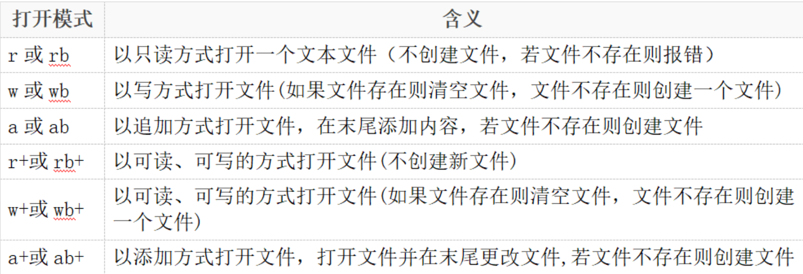

**r只读，w只写，b二进制文件，a追加，+可读可写**

附：

FILE的定义：

```c
struct _iobuf {
    char *_ptr;
    int _cnt;
    char *_base;
    int _flag;
    int _file;
    int _charbuf;
    int _bufsiz;
    char *_tmpfname;
};
typedef struct _iobuf FILE;
```

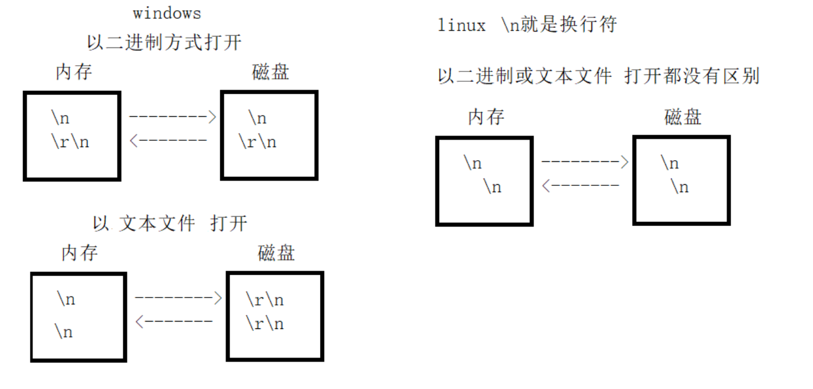

### fclose关闭文件

```c
#include <stdio.h>

int fclose(FILE *stream);
功能：关闭fopen打开的文件，将缓冲区的数据写入文件中，
    并释放系统提供的文件资源
参数：
    stream：文件指针
返回：
    成功：0
    失败：-1
```

例：
```c
#include <stdio.h>
#include <stdlib.h>
int main() {
	FILE *fp = NULL;
	fp = fopen("./tes","rb");
	if (fp == NULL)
	{
		perror("fopen");
		exit(1);
	}

	printf("打开成功\n");

	fclose(fp);

	return 0;
}
```

```shell
# 当test文件存在时
打开成功

# 当不存在时
fopen: No such file or directory
```

## 文件读写

### fputc往文件写一个字符
```c
#include <stdio.h>

int fputc(int ch,FILE *stream);
功能：将ch转换为unsigned char后写入stream文件中
参数：
    ch：字符
    stream：文件指针
返回：
    成功：成功写入文件的字符
    失败：返回-1
```

例：

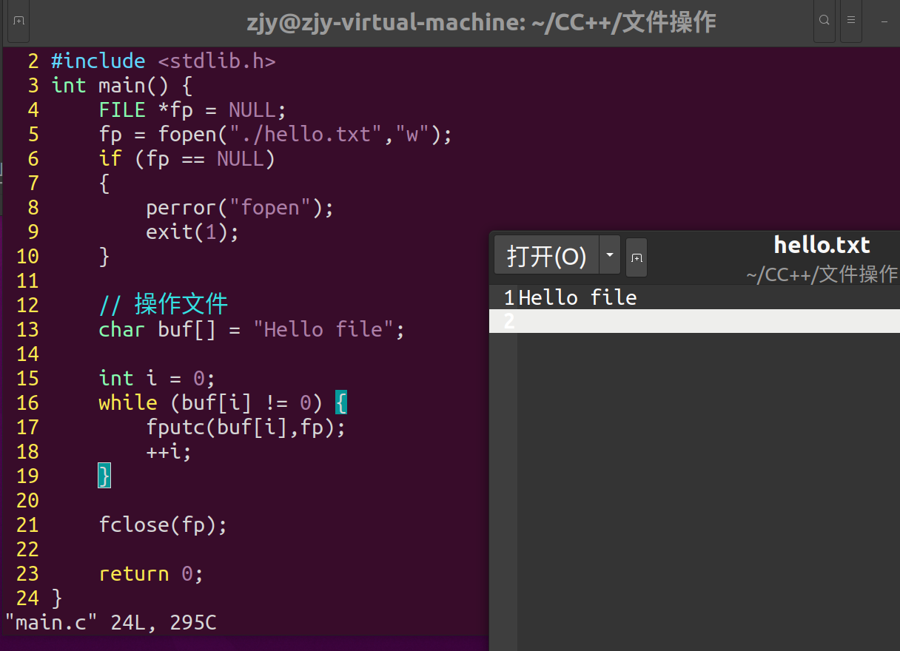

### fgetc读取一个字符

```c
#include <stdio.h>

int fgetc(FILE *stream);
功能：从stream指定的文件里读取一个字符
参数：
    stream：文件指针
返回：
    成功：读取到的字符
    失败：-1
```

#### 判断文件结束

```c
EOF 宏 -1 文本文件
feof 函数 文本文件和二进制文件

int feof(FILE *stream);
功能：检测是否读到了文件结尾。判断的是最后一次“读操作的
    内容”，不是当前位置内容（上一个内容）
参数：
    stream：文件指针
返回：
    非0值：已经到文件结尾
    0：未到文件结尾
```

例：

```c
#include <stdio.h>
#include <stdlib.h>
int main() {
	FILE *fp = NULL;
	fp = fopen("./hello.txt","r");
	if (fp == NULL)
	{
		perror("fopen");
		exit(1);
	}

	// 操作文件
	while (1) {
		char ch = 0;
		ch = fgetc(fp);
		// 判断文件末尾
		// EOF
		// if (ch == EOF)
		// {
		//		break;
		// }
		if (feof(fp)) {
			break;
		}

		printf("%c",ch);
	}
	printf("\n");

	fclose(fp);

	return 0;
}
```

```shell
Hello file
```

### 实例1：二进制文件读取器
```c
#include <stdio.h>
#include <stdlib.h>

int main(int argc, char *argv[])
{
	if (argc < 2)
	{
		printf("ERROR:参数过少。。。");
		exit(1);
	}
	else if (argc > 2)
	{
		printf("ERROR:参数过多。。。");
		exit(1);
	}
	else
	{
		FILE *fp = NULL;
		fp = fopen(argv[1], "rb");
		if (fp == NULL)
		{
			perror("fopen");
			exit(1);
		}
		while (1)
		{
			char ch = 0;
			ch = fgetc(fp);
			if (feof(fp))
			{
				printf("\n");
				break;
			}
			printf("%-#x\t", ch);
		}
	}

	return 0;
}
```

效果：


### fputs写入字符串

```c
int fputs(const char *str,FILE *stream);
功能：将str字符串写入stream文件中
参数：
    str：字符串
    stream：文件指针
返回：
    成功：0
    失败：-1
```

例：

```c
#include <stdio.h>
#include <stdlib.h>
int main() {
	FILE *fp = NULL;
	fp = fopen("./hello.txt","w");
	if (fp == NULL)
	{
		perror("fopen");
		exit(1);
	}

	// 操作文件
	char *buf[] = {"大漠孤烟直\n","长河落日园"};

	for (size_t i = 0; i < sizeof(buf)/sizeof(buf[0]); ++i) {
		fputs(buf[i],fp);
	}

	fclose(fp);

	return 0;
}
```

```shell
# hello.txt
大漠孤烟直
长河落日园
```

### fgets获取一行

```c
#include <stdio.h>
char *fgets(char *str,int size,FILE *stream);
功能：从stream文件中读取字符，写入str中，
     直到出现换行符、文件结尾或已经读了size-1个字符为止，
     最后会自动加上'\0'
参数：
	str：字符串
	size：最大读取字符串的长度
	stream：文件指针
返回：
	成功：字符串
	读到文件尾或出错：NULL
```

例：四则运算解题神器

题目：

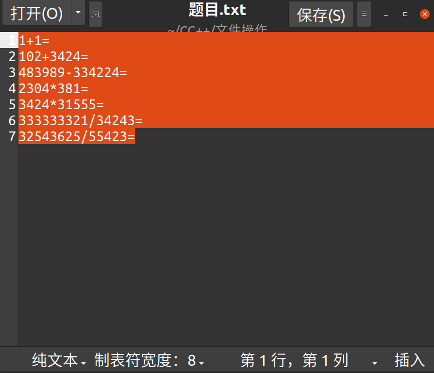

代码：

```c
#include <stdio.h>
#include <stdlib.h>

int main() {
	FILE *fp = fopen("题目.txt","r");

	if (fp == NULL)
	{
		perror("fopen");
		exit(1);
	}

	char buf[128] = "";
	while (fgets(buf,sizeof(buf),fp))
	{
		int num1 = 0, num2 = 0;
		char ch = 0;

		// 解包
		sscanf(buf, "%d%c%d=", &num1, &ch, &num2);

		// 计算
		int sum = 0;
		switch (ch)
		{
		case '+':
			sum = num1 + num2;
			break;
		case '-':
			sum = num1 - num2;
			break;
		case '*':
			sum = num1 * num2;
		case '/':
			sum = num1 / num2;
			break;
		}

		printf("%d%c%d = %d\n",num1,ch,num2,sum);
	}

	if (fp != NULL)
	{
		fclose(fp);
		fp = NULL;
	}

	return 0;
}
```

```shell
1+1 = 2
102+3424 = 3526
483989-334224 = 149765
2304*381 = 6
3424*31555 = 0
333333321/34243 = 9734
32543625/55423 = 587
```

## 文件高级操作

### 文件重命名和删除

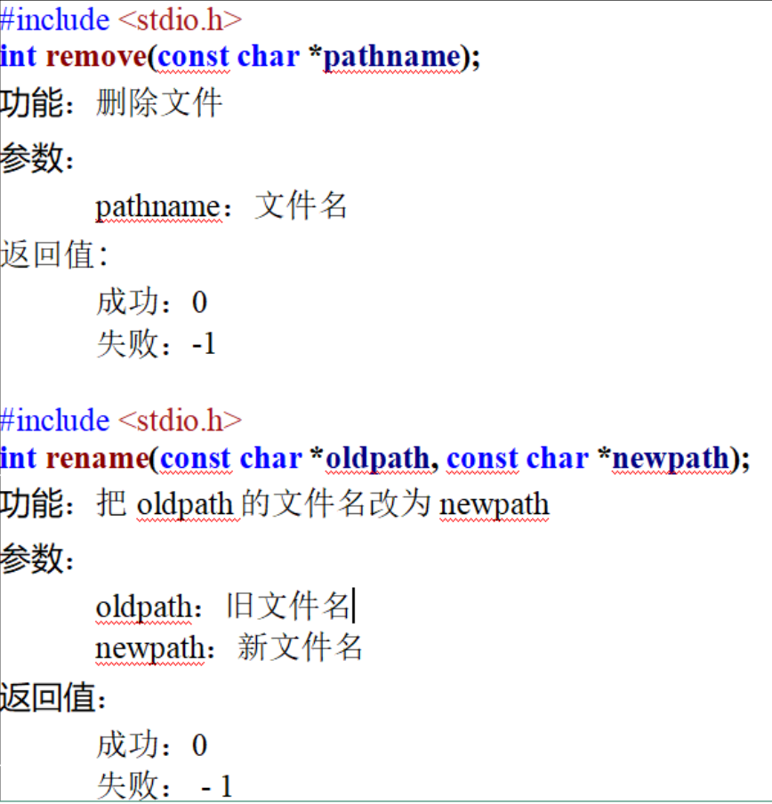

### 文件的块读写

>将内存中的数据原样输出在文件

#### fwrite

```c
#include <stdio.h>
size_t fwrite(const void *ptr, size_t size, size_t nmemb, FILE *stream)
功能：把 ptr 所指向的数组中的数据写入到stream 中
参数：
	ptr：指向要被写入的元素数组的指针。
	size：要被写入的每个元素的大小，以字节为单位。
	nmemb：元素的个数，每个元素的大小为 size 字节
	stream：文件指针
返回：
	如果成功，该函数返回一个 size_t 对象，
	表示元素的总数，该对象是一个整型数据类型。
	如果该数字与 nmemb 参数不同，则会显示一个错误
```

```c
#include <stdio.h>
#include <stdlib.h>

typedef struct {
	char name[16];
	int age;
	float score;
}stu;

int main() {
	stu student[3] = {
		{"小李",13,100},
		{"小红",14,119},
		{"小明",15,120}
	};
	FILE *fp = fopen("./student.txt","w");
	if (fp == NULL)
	{
		perror("fopen");
		exit(1);
	}

	fwrite(student,sizeof(stu),3,fp);
	fclose(fp);

	return 0;
}
```

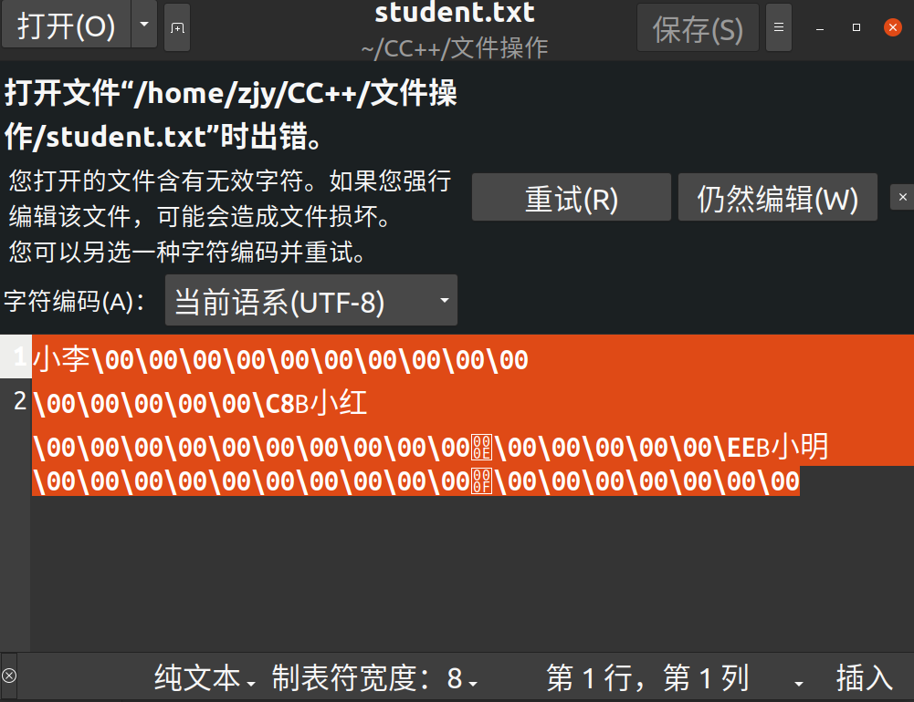

#### fread

```c
size_t fread(void *ptr, size_t size, size_t nmemb, FILE *stream);
功能：从给定流 stream 读取数据到 ptr 所指向的数组中
参数：
	ptr：指向带有最小尺寸 size*nmemb 字节的内存块的指针
	size：要读取的每个元素的大小，以字节为单位
	nmemb：元素的个数，每个元素的大小为 size 字节
	stream：文件指针
返回：
	成功读取的元素总数会以 size_t 对象返回，
	size_t 对象是一个整型数据类型。
	如果总数与 nmemb 参数不同，
	则可能发生了一个错误或者到达了文件末尾
```

```c
#include <stdio.h>
#include <stdlib.h>

typedef struct {
	char name[16];
	int age;
	float score;
}stu;

int main() {
	stu student[3];
	FILE *fp = fopen("./student.txt","r");
	if (fp == NULL)
	{
		perror("fopen");
		exit(1);
	}

	int n = fread(student,sizeof(stu),3,fp);
	for (size_t i = 0; i < n; ++i)
	{
		printf("name = %s, age = %d, score = %.2f\n",student[i].name,student[i].age,student[i].score);
	}
	fclose(fp);

	return 0;
}
```

```shell
name = 小李, age = 13, score = 100.00
name = 小红, age = 14, score = 119.00
name = 小明, age = 15, score = 120.00
```

### 格式化读写

#### fprintf

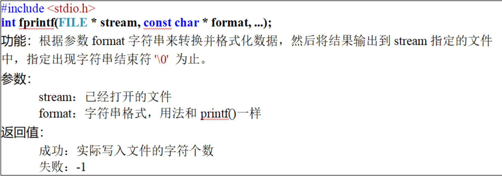

#### fscanf

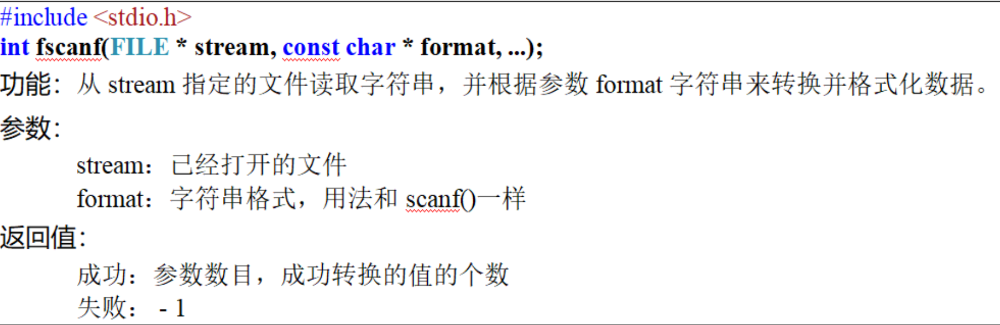

### 复位流指针

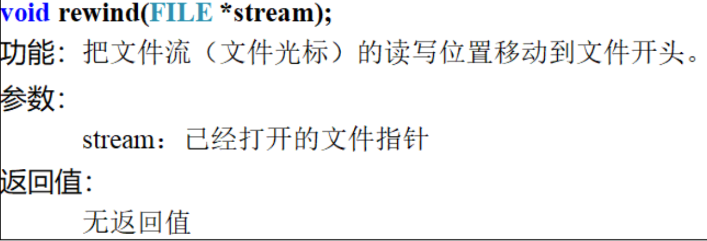

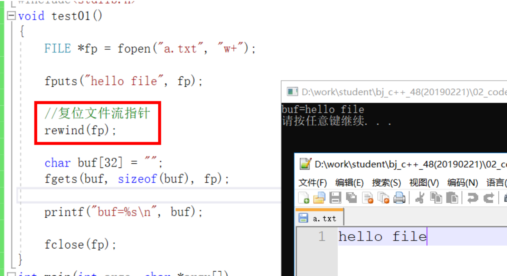

### 设置文件流指针

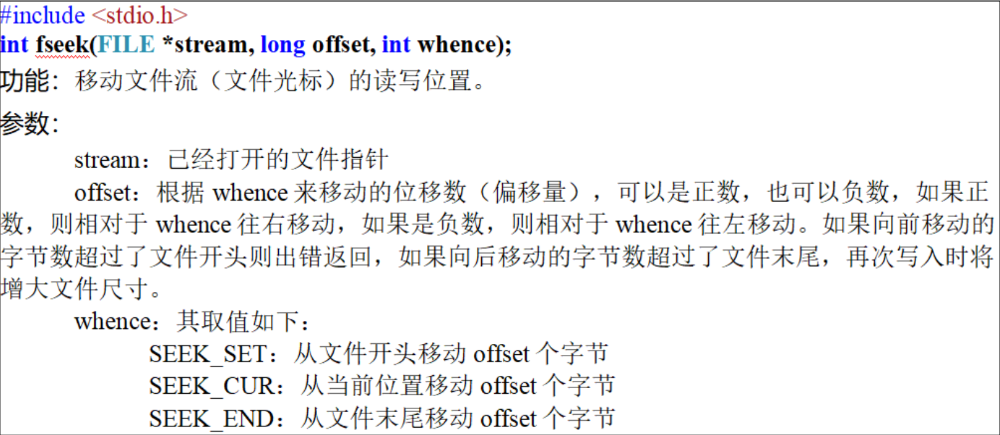

>成功：0；失败：-1

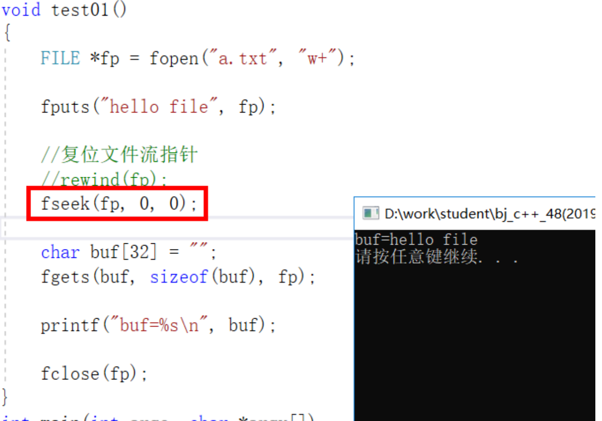

### ftell返回文件流指针距离文件首部的偏移量（字节）

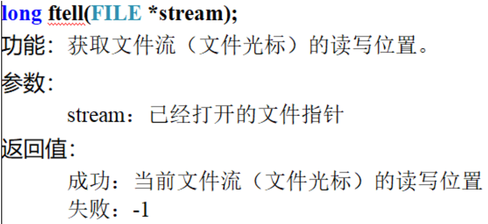

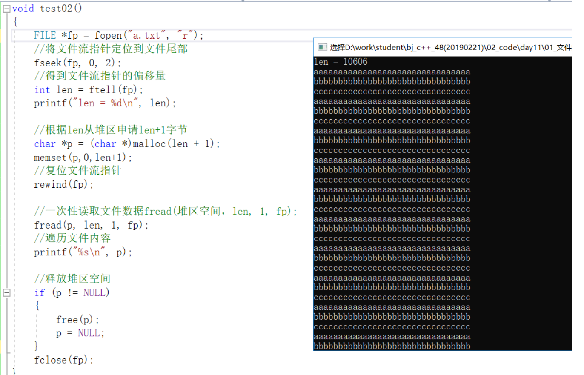

### 获取文件状态

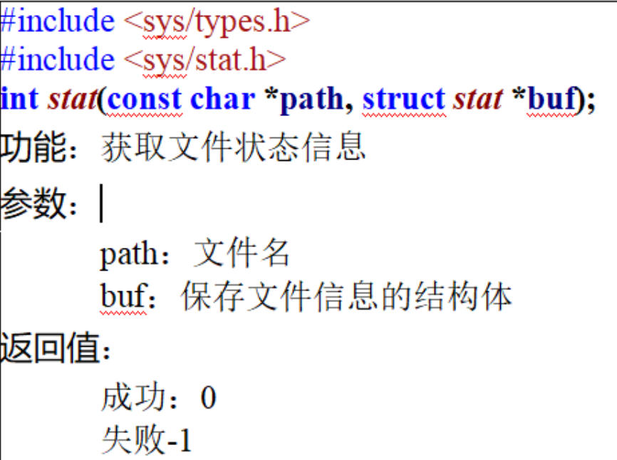

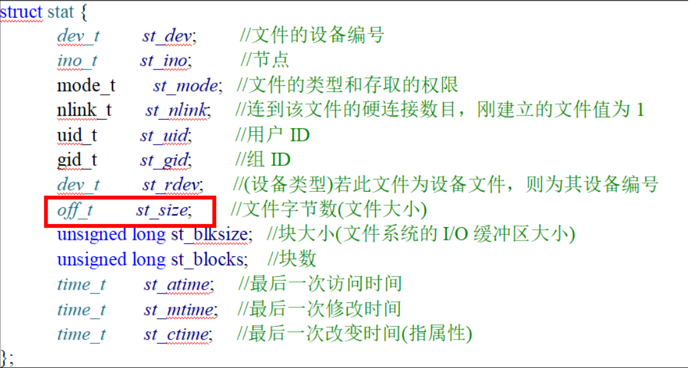

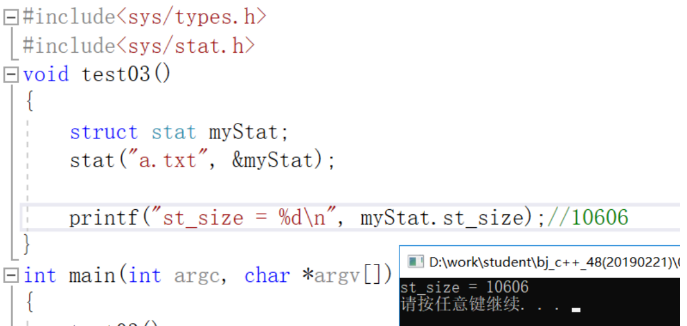

### 缓冲区

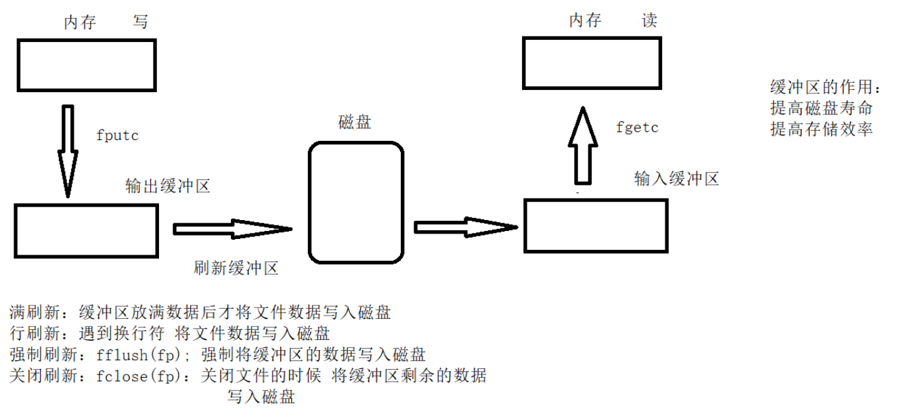