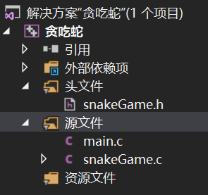
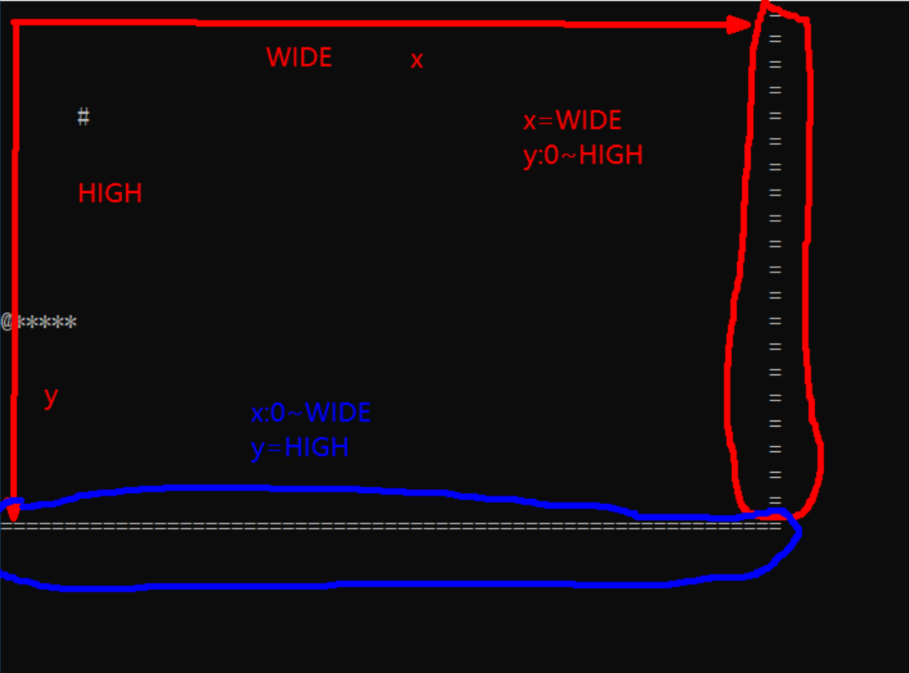
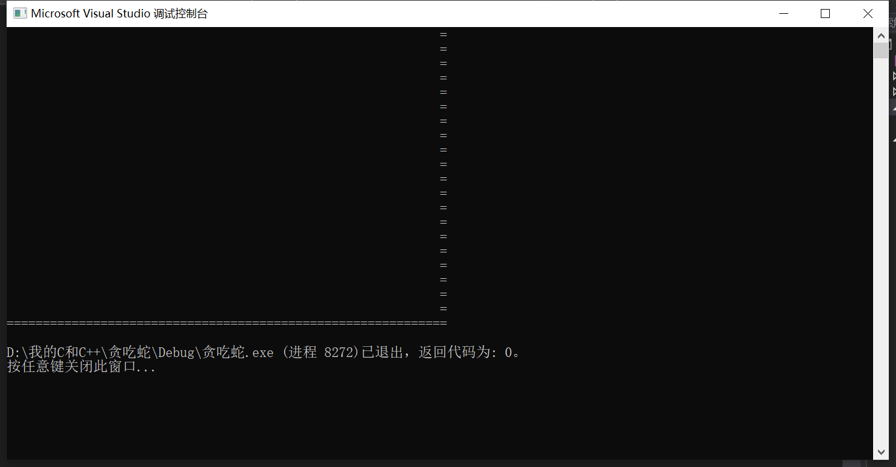
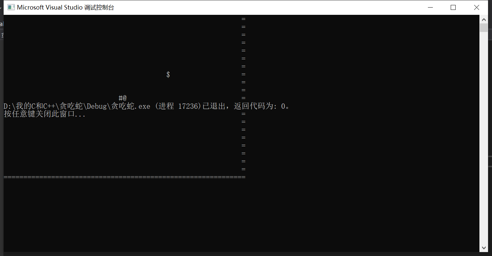

# 项目案例：贪吃蛇



## 1. 初始化墙



代码：

```c
// 初始化墙
void init_wall(void)
{
	for (size_t y = 0; y <= HIGH; ++y)
	{
		for (size_t x = 0; x <= WIDE; ++x)
		{
			if (x == WIDE || y == HIGH) // 判断是否到墙
			{
				printf("=");
			}
			else
			{
				printf(" ");
			}
		}
		printf("\n");
	}
}
```

效果：



## 2. 定义蛇和食物类型

```c
typedef struct
{
	int x;
	int y;
}FOOD; // 食物

typedef struct
{
	int x;
	int y;
}BODY; // 身体

typedef struct
{
	int size; // 身体长度
	BODY body[WIDE*HIGH];
}SNAKE; // 蛇
```

## 3. 初始化蛇和食物

```c
// 定义一个蛇和食物
SNAKE snake;
FOOD food;

// 初始化食物
void init_food(void)
{
	food.x = rand() % WIDE; // 随机生成坐标
	food.y = rand() % HIGH;
}

// 初始化蛇
void init_snake(void)
{
	snake.size = 2;

	// 将蛇头初始化到墙中间
	snake.body[0].x = WIDE / 2;
	snake.body[0].y = HIGH / 2;
	// 蛇身紧跟蛇头
	snake.body[1].x = WIDE / 2 - 1;
	snake.body[1].y = HIGH / 2;
}
```

## 4. 显示UI

```c
// 显示UI
void showUI(void)
{
	// 显示食物
	// 存放光标位置
	COORD coord;
	coord.X = food.x;
	coord.Y = food.y;

	// 光标定位
	SetConsoleCursorPosition(GetStdHandle(STD_OUTPUT_HANDLE), coord);
	putchar('$');

	// 显示蛇
	for (size_t i = 0; i < snake.size; ++i)
	{
		// 设置光标
		coord.X = snake.body[i].x;
		coord.Y = snake.body[i].y;

		SetConsoleCursorPosition(GetStdHandle(STD_OUTPUT_HANDLE), coord);

		if (i == 0)
		{
			putchar('@');
		}
		else
		{
			putchar('#');
		}
	}
}
```

效果：



## 最终代码

```c
// main.c
#define _CRT_SECURE_NO_WARNINGS
#include "./snakeGame.h"

int main(void)
{
	// 取消光标
	CONSOLE_CURSOR_INFO cci;
	cci.bVisible = FALSE; // 取消光标
	cci.dwSize = sizeof(cci);
	SetConsoleCursorInfo(GetStdHandle(STD_OUTPUT_HANDLE),&cci);

	system("color 2");
	printf("欢迎来到贪吃蛇！！！\n准备好了吗？按s/S开始，q/Q退出\n");
	char ch = _getch();
	switch (ch)
	{
	case 's':
	case 'S':
		system("color 0");
		system("cls");
		break;
	default:
		return 0;
	}

	init_wall();
	init_food();
	init_snake();
	showUI();
	playGame();

	return 0;
}
```

```c
// snakeGame.c
#include "./snakeGame.h"

// 定义一个蛇和食物
SNAKE snake;
FOOD food;
// 方向增量
int dx = 0;
int dy = 0;
int lx, ly; // 尾节点

// 初始化食物
void init_food(void)
{
	food.x = rand() % WIDE; // 随机生成坐标
	food.y = rand() % HIGH;
}

// 初始化蛇
void init_snake(void)
{
	snake.size = 2;
	snake.fraction = 0;

	// 将蛇头初始化到墙中间
	snake.body[0].x = WIDE / 2;
	snake.body[0].y = HIGH / 2;
	// 蛇身紧跟蛇头
	snake.body[1].x = WIDE / 2 - 1;
	snake.body[1].y = HIGH / 2;
}

// 初始化墙
void init_wall(void)
{
	for (size_t y = 0; y <= HIGH; ++y)
	{
		for (size_t x = 0; x <= WIDE; ++x)
		{
			if (x == WIDE || y == HIGH) // 判断是否到墙
			{
				printf("=");
			}
			else
			{
				printf(" ");
			}
		}
		printf("\n");
	}
	printf("分数：0\n");
}

// 显示UI
void showUI(void)
{
	// 显示食物
	// 存放光标位置
	COORD coord;
	coord.X = food.x;
	coord.Y = food.y;

	// 光标定位
	SetConsoleCursorPosition(GetStdHandle(STD_OUTPUT_HANDLE), coord);
	putchar('$');

	// 显示蛇
	for (size_t i = 0; i < snake.size; ++i)
	{
		// 设置光标
		coord.X = snake.body[i].x;
		coord.Y = snake.body[i].y;

		SetConsoleCursorPosition(GetStdHandle(STD_OUTPUT_HANDLE), coord);

		if (i == 0)
		{
			putchar('@');
		}
		else
		{
			putchar('#');
		}
	}

	// 处理尾节点
	coord.X = lx;
	coord.Y = ly;
	SetConsoleCursorPosition(GetStdHandle(STD_OUTPUT_HANDLE), coord);
	putchar(' ');
	coord.X = WIDE;
	coord.Y = HIGH;
	SetConsoleCursorPosition(GetStdHandle(STD_OUTPUT_HANDLE), coord);
	printf("\n分数：%d\n",snake.fraction);
}

void playGame(void)
{
	COORD _coord;
	system("color 7");
	char key = 'D';

	// 蛇不能撞墙
	while (snake.body[0].x >= 0 && snake.body[0].x <= WIDE && snake.body[0].y >= 0 && snake.body[0].y <= HIGH)
	{
		// 蛇不能撞自己
		for (size_t i = 1; i < snake.size; ++i)
		{
			if (snake.body[0].x == snake.body[i].x && snake.body[0].y == snake.body[i].y)
			{
				goto OVER;
			}
		}

		// 撞食物
		if (snake.body[0].x == food.x && snake.body[0].y == food.y)
		{
			++snake.size;
			++snake.fraction;
			// 随机出现食物
			init_food();
		}

		// 控制蛇移动

		// 判断是否按下按键
		if (_kbhit())
		{
			key = _getch(); // 不需要敲回车，按下就立马确认
		}

		// 判断W A S D中哪个按键按下
		switch (key)
		{
		case 'w':
		case 'W':
			dx = 0;
			dy = -1;
			break;
		case 'a':
		case 'A':
			dx = -1;
			dy = 0;
			break;
		case 's':
		case 'S':
			dx = 0;
			dy = 1;
			break;
		case 'd':
		case 'D':
			dx = 1;
			dy = 0;
			break;
		case 'q':
		case 'Q':
			_coord.X = WIDE;
			_coord.Y = HIGH;
			SetConsoleCursorPosition(GetStdHandle(STD_OUTPUT_HANDLE), _coord);
			putchar('\n');
			return;
		}

		// 蛇移动
		// 记录尾节点位置
		lx = snake.body[snake.size - 1].x;
		ly = snake.body[snake.size - 1].y;
		for (size_t i = snake.size - 1; i > 0; --i)
		{
			snake.body[i].x = snake.body[i - 1].x;
			snake.body[i].y = snake.body[i - 1].y;
		}
		// 更新蛇头
		snake.body[0].x += dx;
		snake.body[0].y += dy;

		showUI();
		Sleep(500); // 延时
	}
	// 游戏结束
OVER:
	system("color 4");
	_coord.X = 6;
	_coord.Y = HIGH + 1;
	SetConsoleCursorPosition(GetStdHandle(STD_OUTPUT_HANDLE), _coord);
	printf("\n游戏结束！！！");
	printf("按r/R重新开始，按q/Q退出\n");
	char _key;
	_key = _getch();
	switch (_key)
	{
	case 'r':
	case 'R':
		system("cls");
		init_wall();
		init_food();
		init_snake();
		showUI();
		playGame();
	case 'Q':
	case 'q':
	default:
		system("color 7");
		return;
	}
}
```

```c
// snakeGame.h
#pragma once
#define _CRT_SECURE_NO_WARNINGS
#include <stdio.h>
#include <stdlib.h>
#include <conio.h>
#include <Windows.h>
#define WIDE 60 // 长
#define HIGH 20 // 高

typedef struct
{
	int x;
	int y;
}FOOD; // 食物

typedef struct
{
	int x;
	int y;
}BODY; // 身体

typedef struct
{
	int size; // 身体长度
	int fraction; // 分数
	BODY body[WIDE*HIGH];
}SNAKE; // 蛇

void init_wall(void);
void init_food(void);
void init_snake(void);
void showUI(void);
void playGame(void);
```