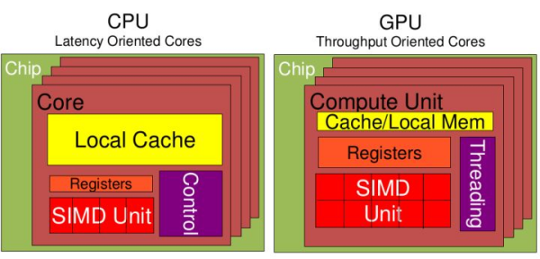

# 人工智能基础

[TOC]

## 人工智能概述

### 历史

<https://baike.baidu.com/item/%E4%BA%BA%E5%B7%A5%E6%99%BA%E8%83%BD/9180?fr=aladdin#9>

### 人工智能、机器学习和深度学习


> 机器学习是人工智能的一个实现途径
>
> 深度学习是机器学习的一个方法发展而来

### 分支

* 计算机视觉：人脸识别
* 语言识别（难题：鸡尾酒会效应、声纹识别）
* 文本挖掘/分类
* 机器翻译
* 机器人

### 必备三要素

* 数据
* 算法
* 计算力

```
逐层、分布、并行算法能力提升
GPU、FPGA、TPU能力大幅提升
```

### CPU和GPU



<https://zhidao.baidu.com/question/422288800.html>

* CPU -> IO密集型
* GPU -> 计算密集型

## 机器学习工作流程

### 定义


> 机器学习是从**数据**中**自动分析获得模型**，利用**模型**对未知数据进行预测

### 工作流程


### 数据集

* 数据简介

  在数据集中一般：

  * 一行数据称为一个**样本**
  * 一列数据称为一个**特征**
  * 有些数据有**目标值（标签值）**，有些数据没有目标值

* 数据类型构成：

  * 特征值+目标值（目标值是连续的和离散的）
  * 只有特征值，没有目标值

* 数据分割

  * 机器学习一般的数据集会划分为两个部分：
    * 训练数据：用于训练，**构建模型**
    * 测试数据：在模型检验时使用，用于**评估模型是否有效**
  * 划分比例：
    * 训练集：70% 80% 75%
    * 测试集：30% 20% 25%

### 数据基本处理

即对数进行缺失值、去除异常值等处理

### 特征工程

#### 什么是特征工程

> 特征工程是使用**专业背景知识和技巧处理数据，使得特征能在机器学习算法上发挥更好的作用的过程。**

* 意义：会直接影响机器学习的效果

#### 为什么需要特征工程

> 数据和特征决定了机器学习的上限，而模型和算法只是逼近这个上限而已

#### 特征工程包含的内容

##### 特征提取

> 将任意数据转换为可用于机器学习的数字特征

##### 特征预处理

> 通过一些**转换函数**将特征数据转换成**更适合算法模型**的特征数据的过程

##### 特征降维

> 在某些限定条件下，**降低随机变量（特征）个数**，得到**一组“不相关”主变量**的过程

## 机器学习算法分类

### 监督学习

* 定义：
  * 输入数据是由输入特征值和目标值所组成
    * 函数的输出可以是一个连续的值（称为回归）
    * 或是输出有限个离散值（称作分类）

#### 回归问题

例如：预测房价，根据样本拟合出一条连续曲线

#### 分类问题

例如：根据肿瘤特征判断是恶性还是良性，是**离散的**

### 无监督学习

* 定义：

  * 输入数据是由输入特征值组成的

    仅有特征值

### 半监督学习

* 定义：

  有特征值，但是一部分数据有目标值，一部分没有

### 强化学习

实质是make decisions问题，即**自动进行决策**，并且可以做连续决策

主要包括：***agent、环境状态、行动、奖励***

> 例：
>
> 小孩要走路，但在这之前他需要先站起来，站起来之后还要保持平衡。接下来还要先迈出一条腿，是左腿还是右腿，迈出一步后还要迈出下一步。
>
> 小孩就是**agent**，他试图通过采取**行动**（即行走）来操纵**环境**（行走的表面），并且**从一个状态转变到另一个状态**（即他走的每一步），当他完成任务的子任务（即走了几步）时，他会得到**奖励**，并且当他不能走路时，就没有奖励

强化学习是动态过程，上一步数据的输出是下一步数据的输入，目的是**获得最多的累计奖励**

### 监督学习和强化学习的对比

|          | 监督学习                                                     | 强化学习                                                     |
| -------- | ------------------------------------------------------------ | ------------------------------------------------------------ |
| 反馈映射 | 输入到输出的一个映射，监督式学习输出的是之间的关系，可以告诉算法什么样的输入对应什么样的输出 | 输入到输出的一个映射，强化学习输出的是给机器的反馈，即用来判断这个行为是好是坏 |
| 反馈时间 | 做了比较坏的选择会**立刻反馈给算法**                         | 结果反馈有延时，有时候可能需要走了很多步以后才知道以前的某一步是好是坏 |
| 输入特征 | 输入是独立同分布的                                           | 面对的输入总是在变化，每当算法做出一个行为，它影响下一次决策的输入 |
| 行为模式 | 不考虑行为间的平衡，只是开发                                 | 一个agent可以在探索和开发中之间做权衡，并且选择一个最大的回报 |

## 模型评估

### 分类模型评估

* 准确率
  * 预测正确数占样本总数的比例
* 精确率
  * 正确预测为正占全部预测为正的比例
* 召回率
  * 正确预测为正占全部正样本的比例
* F1-score
  * 主要用于评估模型的稳健性
* AUC指标
  * 主要用于评估样本不均衡的情况

### 回归模型评估

* 均方根误差

  仅能比较误差是相同单位的模型
  $$
  RMSE = \sqrt{\frac{\sum_{i=1}^{n}(p_i-a_i)^2}{n}}
  $$
  a = 实际目标

  p = 预测目标

* 相对平方误差

  可以比较误差是不同单位的模型
  $$
  RSE = \frac{\sum_{i=1}^n(p_i-a_i)^2}{\sum_{i=1}^n(\overline{a}-a_i)^2}
  $$

* 平均绝对误差

  与原始数据单位相同，仅能比较误差是相同单位的模型。量级近似与均方根误差，但是误差相对小一些
  $$
  MAE = \frac{\sum_{i=1}^n\left\vert p_i-a_i \right\vert}{n}
  $$

* 相对绝对误差

  可以比较误差是不同单位的模型
  $$
  RAE = \frac{\sum_{i=1}^n\left\vert p_i-a_i \right\vert}{\sum_{i=1}^n\left\vert \overline{a}-a_i \right\vert}
  $$
  
* 决定系数

  * 汇总解释度，由平方和术语计算而得
    $$
    R^2 = 1-\frac{\sum_{i=1}^n(p_i-a_i)^2}{\sum_{i=1}^n(a_i-\overline{a})^2}
    $$
    
* R^2描述了回归模型所解释的因变量方差在总方差中的比例。R^2很大，即自变量与因变量之间存在线性关系，如果回归模型是“完美的”，SSE为0，则R^2为1。R^2小，则自变量与因变量之间存在线性关系的证据不令人信服。如果回归模型完全失败，SSE等于SST，没有方差可被回归解释，则R^2为0

### 拟合


## 深度学习简介

### 神经网络简介

<https://baike.baidu.com/item/%E4%BA%BA%E5%B7%A5%E7%A5%9E%E7%BB%8F%E7%BD%91%E7%BB%9C/382460>

深度学习演示：

<http://playground.tensorflow.org/>

