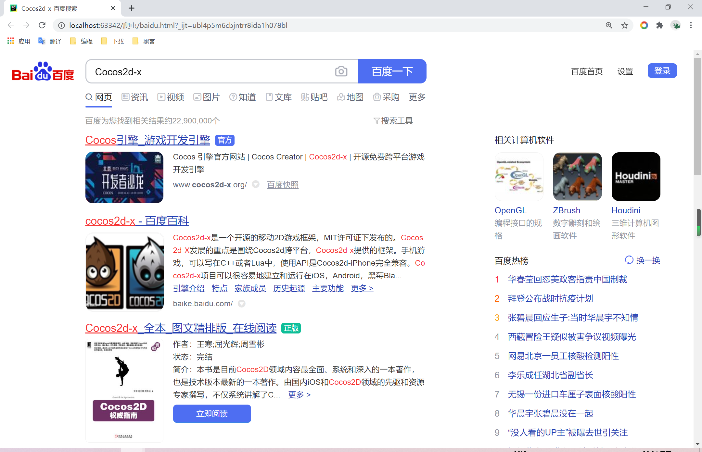
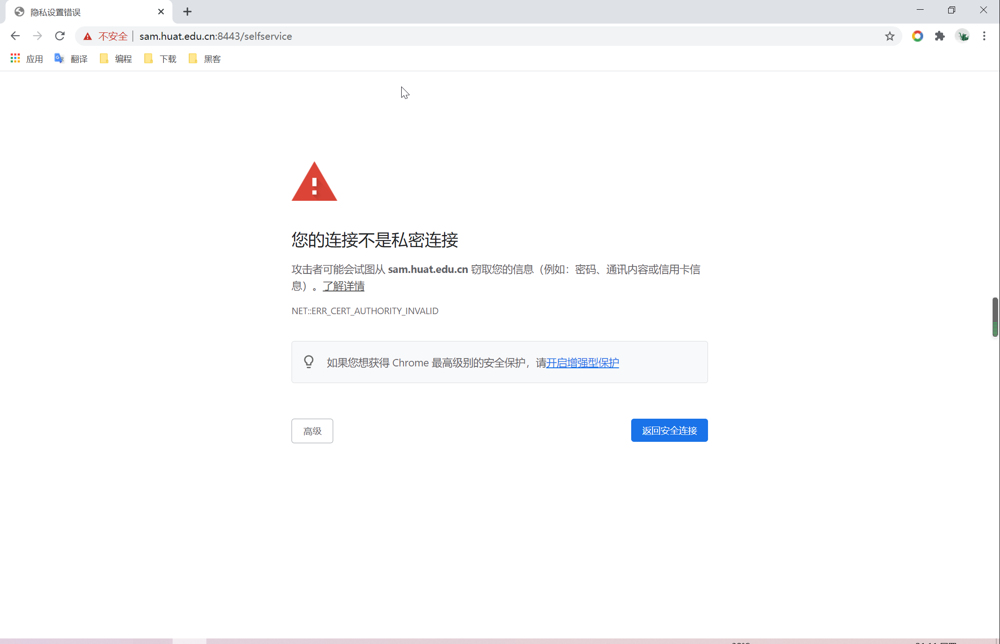

# requests模块

[TOC]

## 简介与安装

### 简介

> requests是python实现的简单易用的HTTP库，使用起来比urllib简洁很多

### 安装

```shell
pip install requests
```

### 官方文档

<https://requests.readthedocs.io/zh_CN/latest/>

## 使用

### 发送get请求

```python
import requests

url = "http://www.baidu.com" # 目标url

res = requests.get(url) # 发送请求

print(res.text) # 打印内容
```

运行结果：

```html
<!DOCTYPE html>
<!--STATUS OK--><html> <head><meta http-equiv=content-type content=text/html;charset=utf-8><meta http-equiv=X-UA-Compatible content=IE=Edge><meta content=always name=referrer><link rel=stylesheet type=text/css href=http://s1.bdstatic.com/r/www/cache/bdorz/baidu.min.css><title>百度一下，你就知道</title></head> <body link=#0000cc> <div id=wrapper> <div id=head> <div class=head_wrapper> <div class=s_form> <div class=s_form_wrapper> <div id=lg>  </div> <form id=form name=f action=//www.baidu.com/s class=fm> <input type=hidden name=bdorz_come value=1> <input type=hidden name=ie value=utf-8> <input type=hidden name=f value=8> <input type=hidden name=rsv_bp value=1> <input type=hidden name=rsv_idx value=1> <input type=hidden name=tn value=baidu><span class="bg s_ipt_wr"><input id=kw name=wd class=s_ipt value maxlength=255 autocomplete=off autofocus></span><span class="bg s_btn_wr"><input type=submit id=su value=百度一下 class="bg s_btn"></span> </form> </div> </div> <div id=u1> <a href=http://news.baidu.com name=tj_trnews class=mnav>新闻</a> <a href=http://www.hao123.com name=tj_trhao123 class=mnav>hao123</a> <a href=http://map.baidu.com name=tj_trmap class=mnav>地图</a> <a href=http://v.baidu.com name=tj_trvideo class=mnav>视频</a> <a href=http://tieba.baidu.com name=tj_trtieba class=mnav>贴吧</a> <noscript> <a href=http://www.baidu.com/bdorz/login.gif?login&amp;tpl=mn&amp;u=http%3A%2F%2Fwww.baidu.com%2f%3fbdorz_come%3d1 name=tj_login class=lb>登录</a> </noscript> <script>document.write('<a href="http://www.baidu.com/bdorz/login.gif?login&tpl=mn&u='+ encodeURIComponent(window.location.href+ (window.location.search === "" ? "?" : "&")+ "bdorz_come=1")+ '" name="tj_login" class="lb">登录</a>');</script> <a href=//www.baidu.com/more/ name=tj_briicon class=bri style="display: block;">更多产品</a> </div> </div> </div> <div id=ftCon> <div id=ftConw> <p id=lh> <a href=http://home.baidu.com>关于百度</a> <a href=http://ir.baidu.com>About Baidu</a> </p> <p id=cp>&copy;2017&nbsp;Baidu&nbsp;<a href=http://www.baidu.com/duty/>使用百度前必读</a>&nbsp; <a href=http://jianyi.baidu.com/ class=cp-feedback>意见反馈</a>&nbsp;京ICP证030173号&nbsp;  </p> </div> </div> </div> </body> </html>
```

### res.text和res.content

```res.text = res.content.decode(推测出来的编码)``

### res的常用属性或方法

* ```res.url```响应的地址
* ```res.status_code```状态码
* ```res.request.headers```请求头
* ```res.headers```响应头
* ```res.request._cookies```请求携带的Cookie
* ```res.cookies```响应携带的Cookie

### 带请求头的请求

* 使用：```res = requests.get(url,headers=headers)```
* headers接收一个字典，如：```{'User-Agent': 'python-requests/2.19.1', 'Accept-Encoding': 'gzip, deflate', 'Accept': '*/*', 'Connection': 'keep-alive'}```

### 发送带参数的请求

#### 直接用含有参数的url发送请求

```python
import requests

url = "https://www.baidu.com/s?&wd=Cocos2d-x"

headers = {"User-Agent":"Mozilla/5.0 (Windows NT 10.0; Win64; x64) AppleWebKit/537.36 (KHTML, like Gecko) Chrome/88.0.4324.96 Safari/537.36"}

res = requests.get(url,headers=headers)

with open("baidu.html","wb") as f:
    f.write(res.content)
```

浏览器打开baidu.html，可以得到如下界面



#### 通过params携带参数字典

1. 构建请求参数字典
2. 向接口发送请求的时候带上参数字典

```python
import requests

url = "https://www.baidu.com/s?"

# 请求参数
kw = {"wd":"Cocos2d-x"}

headers = {"User-Agent":"Mozilla/5.0 (Windows NT 10.0; Win64; x64) AppleWebKit/537.36 (KHTML, like Gecko) Chrome/88.0.4324.96 Safari/537.36"}

res = requests.get(url,headers=headers,params=kw)

with open("baidu.html","wb") as f:
    f.write(res.content)
```


### 代理

#### 概念

1. 代理IP是一个IP，指向的是一个代理服务器
2. 代理服务器能够帮我们向目标服务器转发请求

#### 正向代理和反向代理

正向代理：浏览器知道最终处理请求的服务器的真实IP，如VPN

反向代理：浏览器不知道最终处理请求的服务器的真实IP，如NGINX

#### 代理IP的分类

1. 根据匿名程度
   * 透明代理
   * 匿名代理
   * 高匿代理（***效果最好***）
2. 根据协议
   * http
   * https
   * socks

#### proxies代理参数的使用

* 用法：

  ```python
  res = resquests.get(url,proxies=proxies)
  ```

* 形式：字典

* 例如：

  ```python
  proxies = {
      "http":"http://223.215.18.7:9999",
      "https":"https://223.215.18.7:9999"
  }
  ```

* 使用成功不会有任何报错，失败则要么一直卡住，要么报错

### 使用verify参数忽略CA证书



如图，访问<https://sam.huat.edu.cn:8443/selfservice>会显示不是私密连接，这是因为网站的CA证书没有结果官方认证

在代码中访问会报错：

```python
Traceback (most recent call last):
  ...
requests.exceptions.SSLError: HTTPSConnectionPool(host='sam.huat.edu.cn', port=8443): Max retries exceeded with url: /selfservice (Caused by SSLError(SSLError("bad handshake: Error([('SSL routines', 'ssl3_get_server_certificate', 'certificate verify failed')])")))
```

将verify设为False：

```python
import requests

url = "https://sam.huat.edu.cn:8443/selfservice" # 目标url

res = requests.get(url,verify=False) # 发送请求

print(res.content) # 打印内容

# 运行后给出一个警告
xxx.py:857: InsecureRequestWarning: Unverified HTTPS request is being made. Adding certificate verification is strongly advised. See: https://urllib3.readthedocs.io/en/latest/advanced-usage.html#ssl-warnings
  InsecureRequestWarning)

... # 内容
```

### requests发送post请求

* ```res = requests.post(url,data)```
* ```data```参数接收一个字典


如图，点击翻译会有一个post请求，返回结果为json，在json解析网站（<http://www.json.cn/>）查看得到


代码：

```python
import requests
import json

class King(object):
    def __init__(self,word):
        self.url = "https://ifanyi.iciba.com/index.php?c=trans&m=fy&client=6&auth_user=key_ciba&sign=36ebcee871aa270a"
        self.headers = {"User-Agent":"Mozilla/5.0 (Windows NT 10.0; Win64; x64) AppleWebKit/537.36 (KHTML, like Gecko) Chrome/88.0.4324.96 Safari/537.36"}
        self.data = {
            "from":"en",
            "to":"zh",
            "q":word
        }

    def __get_data(self):
        res = requests.post(self.url,data=self.data,headers=self.headers)
        return res.content

    def __parse_data(self,data):
        dict_data = json.loads(data)
        return dict_data["content"]["out"]

    def run(self):
        # 编写爬虫逻辑
        res = self.__get_data()
        print("结果：{}".format(self.__parse_data(res)))

if __name__ == '__main__':
    k = King("python")
    k.run()
```

